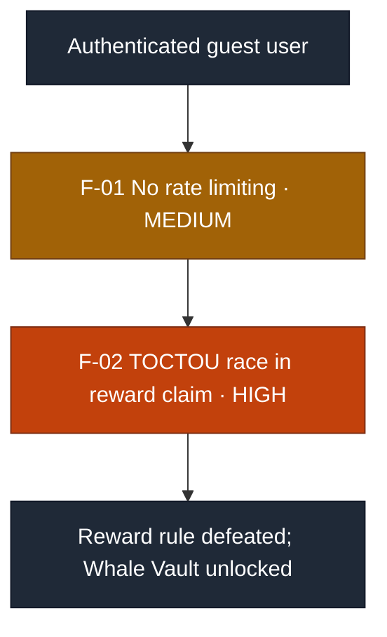
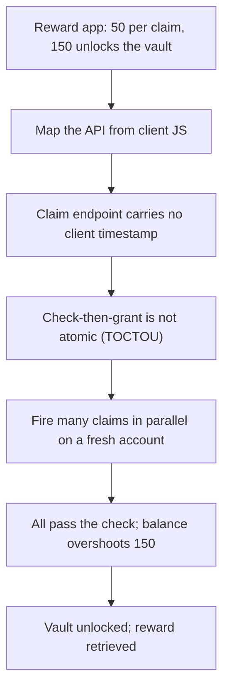

# Security Assessment Report: Business-Logic and API Abuse

**Assessment type:** Black-box web-application business-logic assessment
**Environment:** TryHackMe training target (Hacker Holidays, "Towel on the Sunbed"), the "Ponzi Portfolio" rewards web application
**Assessor:** ouroboros-white
**Report date:** 2026-08-03
**Version:** 1.0
**Classification:** Public

---

> **About this document.** This is a real assessment against a **lab target**,
> written to professional structure. All reconnaissance, exploitation, and
> evidence collection described here was carried out by me against that target.
> Nothing in it is hypothetical, and none of it is reproduced from a walkthrough.
> It is not a live client engagement, and no production system or third party was
> tested. It documents a pure business-logic compromise
> of a web application to demonstrate the reporting deliverable: an attack path,
> CVSS-rated findings, detection analysis, and remediation. Target identifiers are
> redacted as they would be in a client report, and no flags are reproduced.

---

## 1. Executive summary

A Node.js web application that awards a time-limited daily reward was assessed
from an authenticated user perspective. A single **business-logic flaw** let a
user bypass the once-per-24-hours limit and grant themselves an effectively
unlimited reward balance, reaching a privileged application tier (the "Whale
Vault", intended to require sustained legitimate use) in seconds.

No injection or memory-safety bug was involved; the compromise was purely
**logical**, in how the reward claim was processed. The root cause is a **race
condition** (time-of-check to time-of-use) in the claim endpoint: the server
checked eligibility and granted the reward as two separate, non-atomic steps.
Firing many claim requests simultaneously caused them all to pass the eligibility
check before any recorded the claim, so all of them paid out. The **absence of
rate limiting** on the endpoint removed the only practical barrier to sending
them.

Individually the findings are High and Medium; in combination they allow complete
defeat of the application's core economic rule.

### Findings at a glance

| ID | Finding | Severity | CVSS 3.1 |
|----|---------|----------|:--------:|
| F-01 | No rate limiting on state-changing endpoints | **Medium** | 5.4 |
| F-02 | Race condition (TOCTOU) in the reward-claim endpoint | **High** | 8.1 |

**Overall risk: High.** The individual findings are Medium and High, but the engagement turns on F-02, a reliable race that fully defeats the reward-rate rule and mints unlimited in-application currency, so the realised business risk sits at High. This is a qualitative risk rating for the whole engagement, not an aggregate CVSS score (see Appendix A).

**Attack chain at a glance** (severity-highlighted for a management audience): the
missing throttle (F-01) enables the race (F-02), which defeats the reward rule.

Each finding carries a **detection analysis**: the telemetry a monitored
environment would generate. As with lab targets generally, these are expected
detection opportunities, since the application carries no instrumentation of its
own.

---

## 2. Scope and rules of engagement

| Item | Detail |
|------|--------|
| **In-scope asset** | A single Node.js/Express web application (port 3000). |
| **Perspective** | Authenticated, using a self-registered guest account (registration is open). |
| **Objective** | Reach the restricted "Whale Vault" application tier and its gated reward. |
| **Excluded** | Denial-of-service, and any target outside the named application. |
| **Authorisation** | Performed within the TryHackMe platform terms, which authorise exploitation of the provided target. |
| **Window** | 2026-08-03. |

### Target asset

| Attribute | Detail |
|-----------|--------|
| **Hostname / IP** | Redacted, as it would be in a client report |
| **Application** | Node.js / Express web application (the "Ponzi Portfolio" rewards app) |
| **Exposed service** | HTTP on port 3000 |
| **Perspective** | Authenticated, self-registered guest account (open registration) |
| **Assessment date** | 2026-08-03 |

---

## 3. Methodology

The assessment followed the OWASP Web Security Testing Guide, focused on
**business-logic testing** (WSTG-BUSL). The application's API was mapped from its
own client-side script, the reward mechanism was modelled, and the concurrency
behaviour of the value-granting endpoint was tested. Severity is CVSS v3.1 base
score, mapped to CWE. Detection analysis describes expected detection
opportunities, since the target is not instrumented, and a retesting procedure in
section 7 states how each fix would be verified.

**Tooling:** browser developer tools, `curl`. No custom or destructive tooling
was used.

---

## 4. Attack path

1. **Understand the economy.** A guest account was registered. The reward was 50
   units per 24 hours; the restricted tier required 150 (exactly three claims).
2. **Map the API from the client.** The client script exposed the endpoints:
   a state endpoint (`GET .../me`), the reward grant (`POST /claim`, carrying no
   client-supplied time value), and the gated reward (`GET /vault`, returned when
   the balance meets the threshold).
3. **Classify the flaw.** Because the claim request carried no client-controlled
   timestamp and the cooldown was computed server-side, time could not be
   tampered. This pointed to a **concurrency** flaw rather than a
   time-manipulation one.
4. **Exploit the race.** On a freshly registered account (eligible to claim), many
   `POST /claim` requests were sent in parallel. They all passed the eligibility
   check before any recorded the claim, raising the balance to several multiples
   of a single reward in one window.
5. **Collect.** With the balance above the threshold, the gated reward was
   retrieved from the vault endpoint.

Each step depended on understanding the application's own rules; no technical
exploit was used.

### ATT&CK technique mapping

**No ATT&CK mapping is offered for this assessment, and the reason is worth
stating.**

ATT&CK Enterprise catalogues techniques for intruding on systems: exploiting
software, stealing credentials, evading controls, moving laterally. Nothing in
this engagement did any of that. The application was used exactly as built, over
its documented endpoints, with a legitimately registered account, and no request
sent was individually invalid. The flaw was that the application's own rules did
not hold when its endpoints were called concurrently.

Forcing a mapping would mean choosing a technique that describes the network
traffic rather than the attack, and that misleads in both directions: it suggests
to a defender that ATT&CK-derived detection covers this class of flaw, and it
misrepresents what was actually done. Business-logic abuse is a known blind spot
in the framework rather than an oversight in this report.

The coverage that does apply is **OWASP**: this is API6:2023 Unrestricted Access
to Sensitive Business Flows, with the concurrency defect itself recorded as
CWE-367 (TOCTOU) in F-02. Detection for it lives in application telemetry rather
than host or network telemetry, which is the argument made in the detection
analysis for both findings.

---

## 5. Detailed findings

### F-01: No rate limiting on state-changing endpoints

| | |
|---|---|
| **Severity** | **Medium** |
| **CVSS 3.1** | 5.4, `AV:N/AC:L/PR:L/UI:N/S:U/C:L/I:L/A:N` |
| **CWE** | CWE-770: Allocation of Resources Without Limits or Throttling |
| **Affected component** | Application API (state-changing endpoints) |
| **Status** | Open |

**CVSS rationale.** `C:L/I:L` because on its own the missing throttle enables only
limited abuse; its real weight is as the amplifier for F-02, which the executive
summary captures as the combined outcome.

**Description.** The claim endpoint accepted unlimited rapid requests with no
throttling. This both enabled the race in F-02 (by allowing a large concurrent
burst) and would permit other automated abuse of value-granting or
authentication-related endpoints.

**Business impact.** Removes the practical barrier to concurrency and automation
attacks, directly amplifying F-02 and exposing the application to resource
exhaustion and brute-force-style abuse.

**Expected detection opportunities.** High request rates per session or source IP
to state-changing endpoints are the signal; standard rate-limiting and
anti-automation telemetry catch it.

**Remediation.** Apply per-user and per-IP rate limiting to state-changing
endpoints, especially those that grant value, in combination with the atomic fix
in F-02.

### F-02: Race condition (TOCTOU) in the reward-claim endpoint

| | |
|---|---|
| **Severity** | **High** |
| **CVSS 3.1** | 8.1, `AV:N/AC:L/PR:L/UI:N/S:U/C:H/I:H/A:N` |
| **CWE** | CWE-367: Time-of-check Time-of-use Race Condition (and CWE-362) |
| **Affected component** | Reward-claim endpoint |
| **Status** | Open |

**CVSS rationale.** `PR:L` because any self-registered user can exploit it; `AC:L`
because the unsynchronised implementation made the race reliable on the first
attempt; `C:H/I:H` for full defeat of the reward rule and corruption of the balance
ledger, with `A:N` as availability is unaffected.

**Description.** The claim endpoint verified eligibility ("has the cooldown
elapsed?") and then granted the reward and recorded the claim as **separate,
non-atomic operations**. When requests arrive concurrently, they interleave
between the check and the update, so many requests observe "eligible" before any
of them writes "claimed", and every one of them grants the reward.

**Evidence (sanitised).** From a freshly registered, eligible account, a burst of
parallel `POST /claim` requests raised the account balance to several multiples of
a single reward in one cooldown window, versus the one grant the rule intends.
The inflated balance unlocked the restricted tier and its gated reward.

**Business impact.** Complete bypass of the reward-rate business rule. A user can
mint effectively unlimited in-application currency and reach privileged states
meant to gate exclusive content. In any system where the currency has real value,
this is direct financial loss and corruption of the economy's integrity.

**Expected detection opportunities.** Two signals. At the request layer, a burst of
near-simultaneous, identical state-changing requests from a single session is the
signature of a race attempt. At the data layer, the reward ledger increasing
faster than the business rule allows (more than one grant inside a single cooldown
window) is a definitive, rule-based tell. Alert on per-session request bursts to
value-granting endpoints and on any rule-violating ledger delta.

**Remediation.** Make the check-and-grant **atomic**. Enforce the rule at the data
layer with a database transaction and row lock, or a single conditional update
(grant only where the recorded last-claim time is older than the window), so
concurrent requests serialise and exactly one succeeds. Never enforce a
value-granting rule with a pre-check that is separate from the action it guards.

---

## 6. Remediation roadmap

| Priority | Action | Findings |
|:--------:|--------|----------|
| **1 (Now)** | Make the claim check-and-grant atomic (transaction, row lock, or conditional update) | F-02 |
| **2 (Now)** | Add per-user and per-IP rate limiting to state-changing endpoints | F-01 |
| **3 (Ongoing)** | Review every "once per period" and value-granting operation for concurrency safety; treat business rules as data-layer invariants, not application-layer pre-checks | All |

---

## 7. Retesting

Each finding below states the specific check that confirms the fix, so a retest
produces a pass or fail rather than an opinion. Retesting should be run from the
same position as the original assessment: an ordinary self-registered account with
no special privileges.

| Finding | Retest check | Pass condition |
|---|---|---|
| F-01 | Issue a sustained series of requests to each state-changing endpoint from one account, and again from one source IP across several accounts | Both per-user and per-IP limits engage and the endpoint throttles or rejects, rather than serving every request |
| F-02 | From a freshly registered, eligible account, send a burst of genuinely parallel `POST /claim` requests inside one cooldown window | Exactly one claim succeeds; every other request is rejected, and the ledger records exactly one grant |

Three points decide whether this retest is meaningful.

**Sequential requests do not test a race.** A retest that sends claims one after
another will pass against the unfixed code, because the vulnerability only appears
when requests interleave between the check and the update. The requests have to be
genuinely concurrent, issued in parallel and timed to arrive together, or the
retest is a false pass.

**The rate limit can hide an unfixed race.** F-01 and F-02 have to be retested
independently, because a per-user throttle prevents the burst that triggers the
race without making the check-and-grant atomic. Verified together, a working rate
limit produces a passing result for F-02 while the underlying flaw is untouched,
and it then reappears the moment the limit is raised, bypassed with distributed
sources, or removed during a performance fix. Confirm F-02 with the rate limit
lifted in a test environment, so what is being measured is the atomicity of the
claim itself.

**Check the ledger, not just the response.** The endpoint returning a single
success message is not proof. The authoritative check is the stored balance and
the claim record after the burst, because a non-atomic implementation can return
one visible success while having written several grants.

Where the fix is a database transaction or conditional update, the retest should
also confirm it holds under the deployment's real concurrency model. A row lock
that works on a single application instance can still be defeated if the fix was
implemented in application code and the service is horizontally scaled.

---

## 8. Conclusion

The application was defeated not by a technical exploit but by a logical one: it
trusted that a "check, then act" sequence would run without interruption.
Concurrency broke that assumption. The lesson generalises to any value-granting
operation: **a business rule must be enforced as an atomic, data-layer invariant,
because any check performed separately from the action it guards can be raced.** A
single lock closes the entire class.

---

## Appendix A: Severity methodology

Severity is CVSS v3.1 base score. Bands: Critical 9.0 to 10.0, High 7.0 to 8.9,
Medium 4.0 to 6.9, Low 0.1 to 3.9. The race condition is rated with Attack
Complexity Low because the naive, unsynchronised implementation made it reliably
exploitable on the first attempt; a hardened implementation would raise complexity.

**Why there is no single overall CVSS score.** CVSS 3.1 scores an individual vulnerability, and the standard is explicit that it is not designed to express the aggregate risk of a system or an engagement. Summing, averaging, or taking the maximum of the findings' scores would misuse the metric, so the overall exposure is stated instead as a qualitative risk band in the executive summary, while the per-finding scores are left to mean exactly what CVSS defines them to mean.

## Appendix B: Tooling

Browser developer tools and `curl`. No custom or destructive tooling was used.
