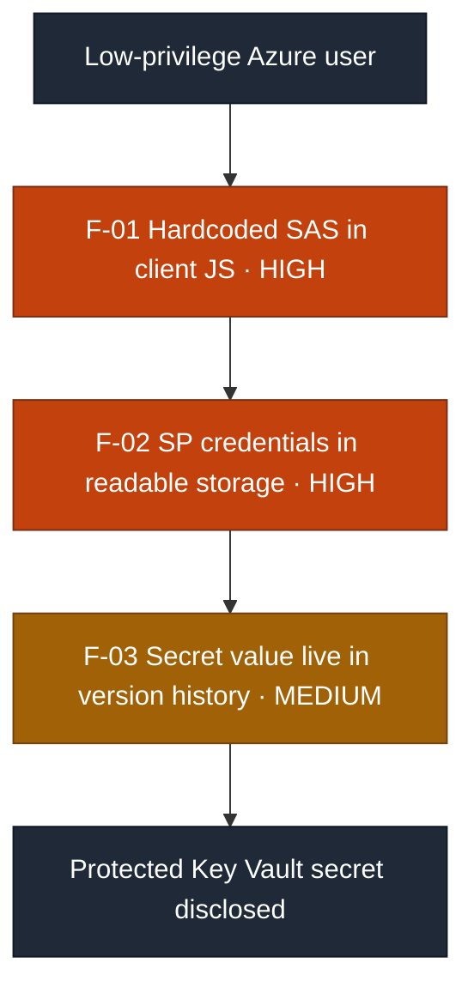
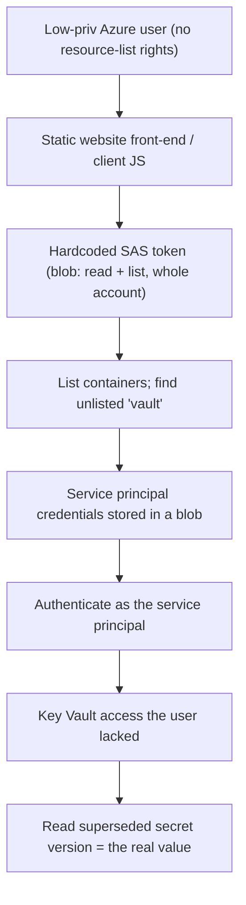

# Security Assessment Report: Azure Cloud Attack Chain

**Assessment type:** Credentialed black-box Azure cloud assessment (low-privilege start)
**Environment:** TryHackMe training target (Hacker Holidays, "CryptoCabana"), an Azure-hosted seed-phrase backup application
**Assessor:** ouroboros-white
**Report date:** 2026-08-04
**Version:** 1.0
**Classification:** Public

---

> **About this document.** This is a real assessment against a **lab target**,
> written to professional structure. All reconnaissance, exploitation, and
> evidence collection described here was carried out by me against that target.
> Nothing in it is hypothetical, and none of it is reproduced from a walkthrough.
> It is not a live client engagement, and no production system or third party was
> tested. It documents a cloud identity-and-access
> compromise to demonstrate the reporting deliverable. Resource names, tokens, and
> credentials are redacted as they would be in a client report; no flags are
> reproduced.

---

## 1. Executive summary

An Azure-hosted web application (the "kiosk"), backed by Azure Storage and Azure
Key Vault, was assessed from a **low-privilege authenticated user with no
resource-management permissions.** Despite that deliberately weak starting point,
a secret held in Key Vault was fully recovered by chaining **four ordinary cloud
misconfigurations.**

The chain: the application's front-end embedded a **hardcoded, over-permissioned
Storage SAS token**; that token granted **read and list across the entire storage
account**; the storage held a **service principal's credentials**; the service
principal held **Key Vault access the user did not**; and the target Key Vault
secret, though "rotated," still **served its original value from version history.**

No single step was sophisticated. The compromise came from trusting the client
with a credential, storing credentials where that credential could read them, and
treating rotation as if it were deletion. The chained real-world outcome is full
disclosure of the protected secret.

### Findings at a glance

| ID | Finding | Severity | CVSS 3.1 |
|----|---------|----------|:--------:|
| F-01 | Hardcoded, over-permissioned SAS token in client-side code | **High** | 7.5 |
| F-02 | Privileged credentials stored in attacker-readable blob storage | **High** | 8.6 |
| F-03 | Secret "rotation" leaves the original value readable in version history | **Medium** | 6.5 |

**Attack chain at a glance** (severity-highlighted for a management audience):

Each finding carries a **detection analysis** describing expected detection
opportunities, since the lab environment carries no monitoring of its own.

---

## 2. Scope and rules of engagement

| Item | Detail |
|------|--------|
| **In-scope assets** | One Azure subscription: a Storage account (static website + blob containers) and a Key Vault. |
| **Perspective** | Credentialed, starting as a **low-privilege user** with no management-plane (ARM) permissions. |
| **Objective** | Recover the sensitive secret held in the Key Vault. |
| **Excluded** | Denial-of-service, and any resource outside the provided subscription. |
| **Authorisation** | Performed within the TryHackMe platform terms, which authorise exploitation of the provided target. |
| **Window** | 2026-08-04. |

### Target assets

| Attribute | Detail |
|-----------|--------|
| **Cloud platform** | Microsoft Azure (single subscription) |
| **Tenant / subscription** | Redacted, as it would be in a client report |
| **In-scope resources** | Storage account (static website + blob containers); Azure Key Vault |
| **Starting identity** | Low-privilege Entra ID user, no management-plane (ARM) permissions |
| **Assessment date** | 2026-08-04 |

---

## 3. Methodology

The assessment followed a standard cloud-attack workflow: enumerate the granted
identity, pivot to what the application itself trusts, follow each credential to
the next resource, and recover the objective. Tooling was the **Azure CLI** (`az`)
via Cloud Shell, plus browser developer tools. Severity is CVSS v3.1 base score,
mapped to CWE. Detection analysis describes expected detection opportunities,
since the target is not instrumented, and a retesting procedure in section 7
states how each fix would be verified.

---

## 4. Attack path

1. **Enumerated as the granted user.** `az resource list`, `az storage account
   list`, and `az keyvault list` all returned empty: the user had no
   management-plane rights. This reframed the approach from "enumerate as myself"
   to "what does the application trust to reach storage?"
2. **Read the static site front-end.** Its client-side JavaScript embedded a
   Storage **SAS token**, scoped to blob service at service/container/object level
   with **read and list** permissions and a far-future expiry, where the app only
   needed write access to one container.
3. **Used the SAS to list containers**, revealing a container **not referenced by
   the site**.
4. **Read that container**, which held a **service principal credential file** and
   a decoy secret.
5. **Authenticated as the service principal**, gaining **Key Vault access the user
   lacked**.
6. **Listed the Key Vault secrets.** The target secret's current value was a decoy
   note stating it had been rotated.
7. **Retrieved the secret's previous version**, recovering the real value.

Each rung depended on the one before it; none required elevated starting access.

### ATT&CK technique mapping

| Stage | Finding | Tactic | Technique |
|---|---|---|---|
| SAS token embedded in the static site's client-side JavaScript | F-01 | Credential Access | T1552.001 Unsecured Credentials: Credentials In Files |
| Listing storage containers with the over-scoped token | F-01 | Discovery | T1619 Cloud Storage Object Discovery |
| Reading the unreferenced container's contents | F-02 | Collection | T1530 Data from Cloud Storage |
| Service principal credential file recovered from that container | F-02 | Credential Access | T1552.001 Unsecured Credentials: Credentials In Files |
| Authenticating to Azure as the service principal | F-02 | Defense Evasion | T1078.004 Valid Accounts: Cloud Accounts |
| Listing and reading Key Vault secrets | F-03 | Credential Access | T1555.006 Credentials from Password Stores: Cloud Secrets Management Stores |
| Retrieving the superseded version of the rotated secret | F-03 | Credential Access | T1555.006 Credentials from Password Stores: Cloud Secrets Management Stores |

Two notes on the choices above.

**F-03 maps to the same technique twice, and that is the finding.** Listing the
secret and reading its previous version use the same API surface and the same
permission. The rotation was believed to have removed the value, but retrieving an
older version is not a separate technique a defender could detect independently;
it is the ordinary read path used one step further back. A control that only
watches for the current secret being read never fires.

**T1078.004 sits under Defense Evasion** rather than Privilege Escalation,
following ATT&CK's own placement. The service principal is a legitimate identity
being used in a legitimate way, which is what made this step quiet: nothing about
the authentication itself looks anomalous without knowing where the credential
came from.

---

## 5. Detailed findings

### F-01: Hardcoded, over-permissioned SAS token in client-side code

| | |
|---|---|
| **Severity** | **High** |
| **CVSS 3.1** | 7.5, `AV:N/AC:L/PR:N/UI:N/S:U/C:H/I:N/A:N` |
| **CWE** | CWE-798: Use of Hard-coded Credentials |
| **Affected component** | Storage static website (client-side JavaScript) |
| **Status** | Open |

**CVSS rationale.** `AV:N/PR:N` because the token is embedded in a public web page
and usable by any anonymous visitor with no authentication; `C:H` for full read of
the storage account, with `I:N/A:N` and `S:U` as impact stays within the storage
resource itself.

**Description.** The static web application embedded a Storage Shared Access
Signature (SAS) token as a constant in its client-side JavaScript, so any visitor
who loads the page obtains it. The token was scoped to the blob service at
service, container, and object level, with **read and list** permissions and an
expiry years in the future, where the application only required **write** access
to a single container.

**Evidence (sanitised).** The SAS appeared in the site's front-end script and,
used from the command line, successfully listed and read every container in the
storage account.

**Business impact.** Full read of the entire storage account by any anonymous
visitor, including any credentials or data stored there (see F-02).

**Expected detection opportunities.** Storage diagnostic logs would show read and
list operations spanning many containers from a single SAS, a pattern inconsistent
with the application's write-only purpose. Alert on SAS activity that exceeds the
operations the application legitimately performs.

**Remediation.** Never embed storage credentials in client-side code. Route writes
through a backend, or issue short-lived **user-delegation** SAS tokens scoped to
write-only, a single container, and a minutes-to-hours expiry.

### F-02: Privileged credentials stored in attacker-readable blob storage

| | |
|---|---|
| **Severity** | **High** |
| **CVSS 3.1** | 8.6, `AV:N/AC:L/PR:N/UI:N/S:C/C:H/I:N/A:N` |
| **CWE** | CWE-522: Insufficiently Protected Credentials |
| **Affected component** | Blob storage container |
| **Status** | Open |

**CVSS rationale.** `PR:N` because the credentials are reachable with the anonymous
SAS from F-01; `S:C` (scope changed) because the stored credentials unlock a
*separate* resource (Key Vault) beyond the storage account; `C:H` for exposure of
privileged credentials.

**Description.** A service principal's credentials (client id, secret, tenant) were
stored as a blob in the storage account, readable via the SAS from F-01. Those
credentials granted access to a separate Azure Key Vault, crossing a trust
boundary (hence the scope change in the score).

**Evidence (sanitised).** A credential file in a storage container, reachable with
the F-01 token, was used to authenticate as the service principal and reach the
Key Vault the assessing user could not. The credential file even carried a note
instructing that it be rotated if it ever left the vault; it had left, and had not
been rotated.

**Business impact.** Lateral movement from storage into Key Vault, a different and
more sensitive resource. A stored credential is a standing key waiting to be read.

**Expected detection opportunities.** Azure AD sign-in logs would show the service
principal authenticating from an unusual location or context relative to its
automation baseline. Alert on service-principal sign-ins that deviate from that
baseline.

**Remediation.** Never store credentials in storage. Use a **managed identity** so
no secret exists to steal. Immediately rotate any credential that may have been
exposed.

### F-03: Secret "rotation" leaves the original value readable in version history

| | |
|---|---|
| **Severity** | **Medium** |
| **CVSS 3.1** | 6.5, `AV:N/AC:L/PR:L/UI:N/S:U/C:H/I:N/A:N` |
| **CWE** | CWE-212: Improper Removal of Sensitive Information Before Storage or Transfer |
| **Affected component** | Azure Key Vault secret |
| **Status** | Open |

**CVSS rationale.** `PR:L` because reading version history requires the secret-read
access obtained earlier in the chain; `C:H` because the superseded version still
discloses the real sensitive value; `S:U` as the impact is confined to the Key
Vault secret.

**Description.** The target Key Vault secret had been "rotated" by writing a new
current value, but Azure Key Vault **retains every prior version and serves it on
request.** The original, sensitive value remained fully readable to anyone with
secret-read access.

**Evidence (sanitised).** The secret's current version was a placeholder note;
listing the secret's versions and reading the previous version returned the real,
sensitive value.

**Business impact.** Rotation was relied on to contain a leak but did not, because
the leaked value stayed live in version history. A "we rotated it" response is a
false sense of safety.

**Expected detection opportunities.** Key Vault diagnostic logs would record a
`SecretGet` against a non-current version, which is unusual for legitimate
automation (which reads current values). Alert on any access to a superseded
secret version.

**Remediation.** Treat rotation as insufficient for a *leaked* secret. Disable or
delete superseded versions, and invalidate the value at its source (revoke the
key/credential) rather than only writing a new current value over it.

---

## 6. Remediation roadmap

| Priority | Action | Findings |
|:--------:|--------|----------|
| **1 (Now)** | Remove the SAS token from client code; move writes to a backend or a least-privilege user-delegation SAS | F-01 |
| **2 (Now)** | Remove credentials from storage; switch to a managed identity; rotate the exposed service principal | F-02 |
| **3 (Now)** | Disable/delete superseded Key Vault secret versions; revoke the leaked value at source | F-03 |
| **4 (Ongoing)** | Enforce least privilege on all identities and SAS tokens; audit storage for stored secrets | All |

---

## 7. Retesting

Each finding below states the specific check that confirms the fix, so a retest
produces a pass or fail rather than an opinion. Retesting should be run from the
same external, unauthenticated position as the original assessment, and the chain
re-walked end to end afterwards.

| Finding | Retest check | Pass condition |
|---|---|---|
| F-01 | Load the static site and search the delivered JavaScript and any bundled assets for SAS query parameters; then replay the **originally captured** token against the storage account | No SAS is present in client-delivered code, and the captured token is rejected rather than merely absent from the page |
| F-02 | With the F-01 token replayed and with any newly issued token, attempt to list and read the storage containers for credential material; then attempt to authenticate as the **original** service principal | No credential file is reachable, and the previously disclosed service-principal secret no longer authenticates |
| F-03 | With secret-read access, list every version of the target secret and attempt to read each superseded version | Superseded versions are disabled or deleted and return an error, and the leaked value is invalid at its source |

Three points decide whether this retest is meaningful.

**Removal is not revocation, and this is the whole point of the retest.** Every
finding here disclosed live credential material, and a SAS token is a bearer
credential: it is signed, not stored, so the storage account has no record of it to
delete and no way to refuse it while the signing key remains valid. Taking the
token out of the page stops the *next* visitor from collecting it and does nothing
about the copy an attacker already holds, which stays valid until its expiry years
away. The only fixes that close F-01 are rotating the storage account key the SAS
was signed with, or revoking the user-delegation key if a delegation SAS was used.
A retest that confirms the page is clean and stops there records a pass on a
finding that is still fully exploitable.

**The same logic applies one level up.** F-02's service-principal secret and F-03's
leaked Key Vault value both remain usable until revoked at source. Switching to a
managed identity removes the *reason* the credential existed but does not
invalidate the credential that leaked, so the retest has to confirm the old values
fail to authenticate, not that the storage container is tidy.

**Verify F-03 by listing versions, not by reading the secret.** Reading the current
value returns the placeholder and looks like a pass under any fix or none at all.
The authoritative check is enumerating the secret's version history and confirming
that each superseded version is disabled or purged, because that history is the
thing that actually disclosed the value.

A complete retest should also confirm the SAS issued to replace F-01 is genuinely
least-privilege: write-only, scoped to the single container the application uses,
and expiring in hours rather than years. A correctly relocated token that still
carries read and list across the account has moved the finding rather than fixed
it.

---

## 8. Conclusion

A protected secret was recovered from a low-privilege starting point through four
commonplace cloud mistakes, chained so each unlocked the next: a credential handed
to the client, a credential stored where the first could read it, and a "rotation"
that hid the leaked value rather than destroying it. The unifying lesson is a cloud
restatement of a familiar principle: **an application's identities and tokens must
carry only the access they need, and a leaked secret is not contained until it is
revoked at the source, not merely superseded.**

---

## Appendix A: Severity methodology

Severity is CVSS v3.1 base score. Bands: Critical 9.0 to 10.0, High 7.0 to 8.9,
Medium 4.0 to 6.9, Low 0.1 to 3.9.

The ordering in this table is worth reading carefully, because the lowest-rated
finding is the one that actually discloses the target. F-03 rates Medium (6.5)
since it requires the Key Vault read permission that F-02 supplies, yet it is the
step at which the protected secret leaves the vault. F-02 carries `S:C` because
the credential it exposes is not used against the storage account holding it but
against a separate resource under a different security authority, which is what a
scope change is meant to capture. Findings are rated in isolation; the executive
summary treats full disclosure of the protected secret as the real-world impact,
and the remediation roadmap is ordered by position in the chain rather than by
score.

## Appendix B: Tooling

Azure CLI (`az`) via Azure Cloud Shell, and browser developer tools. No custom or
destructive tooling was used.
