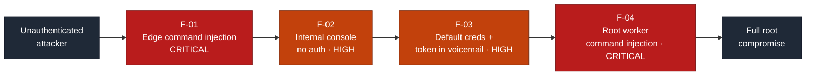
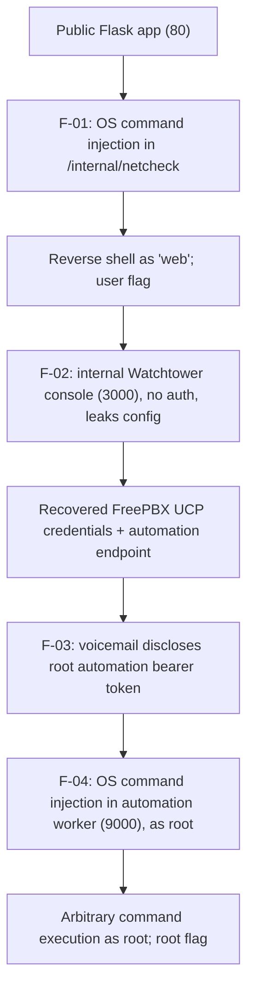

# Security Assessment Report: Command-Injection Chain to Root

**Assessment type:** Black-box web-to-root compromise of a single host
**Environment:** TryHackMe training target ("Infinity Pool", Hacker Holidays)
**Assessor:** ouroboros-white
**Report date:** 2026-08-06
**Version:** 1.0
**Classification:** Public, portfolio sample

---

> **About this document.** This is a real assessment written to professional
> structure against a **lab target**, not a live client engagement. No production
> system or third party was tested. It documents a full web-application-to-root
> compromise of a single host to demonstrate the reporting deliverable: an attack
> path, CVSS-rated findings, detection analysis, and remediation. Target
> identifiers and secrets are redacted as they would be in a client report; no
> flags are reproduced.

---

## 1. Executive summary

A single host running a Python/Flask web application was compromised from an
unauthenticated starting point through to full **root** control. The striking
feature of this target is that the first and last links in the chain are the
**same vulnerability** — user input concatenated into an operating-system shell
command — appearing first at the public edge (as a low-privilege service account)
and again in a privileged internal worker (as root). The intervening steps did
not require exploitation so much as **reading what the environment volunteered**:
an internal console with no authentication that disclosed credentials, and a
privileged API key distributed as a voicemail.

An attacker with no credentials could: run arbitrary commands on the server as
the web account, enumerate internal-only services, recover a set of application
credentials, retrieve a root API token from a voicemail box, and finally run
arbitrary commands **as root** through that API. The most serious issues are the
two command-injection flaws (F-01, F-04); the connective tissue is a missing
internal authentication boundary (F-02) and weak secret handling (F-03).

While each finding is rated individually below, **the combined real-world
severity is Critical**: the chain results in complete compromise of the host.

### Findings at a glance

| ID | Finding | Severity | CVSS 3.1 |
|----|---------|----------|:--------:|
| F-01 | Unauthenticated OS command injection in the connectivity-check feature | **Critical** | 9.8 |
| F-02 | Internal service trusts network position; discloses credentials | **High** | 8.6 |
| F-03 | Default credentials and a privileged API token exposed via message store | **High** | 8.1 |
| F-04 | OS command injection in the root-privileged automation worker | **Critical** | 9.1 |

**Attack chain at a glance** (severity-highlighted for a management audience):

Each finding also carries a **detection analysis**: the telemetry a monitored
environment would generate and why the activity would or would not be caught. As
with lab targets generally, these are expected detection opportunities rather
than observed fact, because the host carries no instrumentation of its own.

---

## 2. Scope and rules of engagement

| Item | Detail |
|------|--------|
| **In-scope asset** | A single host exposing SSH (22) and a Python/Flask web application (80), plus its internal (loopback-only) services. |
| **Perspective** | External, black-box, unauthenticated. No credentials or prior knowledge supplied. |
| **Objective** | Achieve and demonstrate the highest level of access obtainable (root). |
| **Excluded** | Denial-of-service, destructive actions, and any target outside the named host. |
| **Authorisation** | Performed within the TryHackMe platform terms, which authorise exploitation of the provided target. |
| **Window** | 2026-08-06. |

### Target asset

| Attribute | Detail |
|-----------|--------|
| **Hostname** | `tryhackme-24xx` (internal hostname; redacted as it would be in a client report) |
| **IP address** | Redacted. Single in-scope host on the lab network. |
| **Operating system** | Ubuntu Linux (server; confirmed via the `OpenSSH … Ubuntu` service banner) |
| **Externally exposed services** | 22/tcp SSH (OpenSSH 9.6p1); 80/tcp HTTP (gunicorn / Flask) |
| **Internal (loopback-only) services** | 3000/tcp ops console; 8080/tcp FreePBX 16.0.45; 9000/tcp automation worker (runs as root) |
| **Assessment date** | 2026-08-06 |

---

## 3. Methodology

The assessment followed a standard offensive workflow aligned to the Penetration
Testing Execution Standard (PTES) and, for the web layer, the OWASP Web Security
Testing Guide (WSTG): reconnaissance, enumeration, vulnerability analysis,
exploitation, post-exploitation and privilege escalation, then reporting.
Severity is expressed as CVSS v3.1 base score, and each finding is mapped to a
Common Weakness Enumeration (CWE) identifier. Detection analysis describes
expected detection opportunities, since the target is not instrumented.

**Tooling:** `nmap`, `curl`, browser developer tools, `ss`/`systemctl`, `chisel`
(reverse port-forwarding to reach loopback services), and standard Linux
utilities. No destructive tooling was used.

---

## 4. Attack path

The value of this engagement is the chain, so it is documented as a path before
the findings are detailed individually.

1. **Entry (F-01).** The public "connectivity check" passed a user-supplied host
   into a shell `ping` command. A command-separator payload achieved arbitrary
   command execution as the web service account, `web`; a reverse shell recovered
   the user-level objective.
2. **Internal discovery (F-02).** From that foothold, three loopback-only
   services were visible. An internal "Watchtower" console required no
   authentication (it trusts any localhost connection) and its configuration
   endpoint disclosed application credentials and the address of a privileged
   automation service.
3. **Secret recovery (F-03).** The disclosed credentials were unrotated defaults
   for the telephony application. They granted access to a voicemail box whose
   message carried the **bearer token** for the root automation worker.
4. **Root (F-04).** The automation worker (running as root) built a shell command
   from a user-supplied `report` field. The same injection technique as F-01
   yielded arbitrary command execution as root.

A dead end is worth recording: a public FreePBX authenticated-RCE exploit
matched the version banner, but out-of-band testing proved the code path was
patched — the API returned a success acknowledgement without executing injected
commands. The genuine route was secret recovery, not that exploit.

Each rung depended on the one before it; none required insider access.

---

## 5. Detailed findings

### F-01: Unauthenticated OS command injection in the connectivity-check feature

| | |
|---|---|
| **Severity** | **Critical** |
| **CVSS 3.1** | 9.8, `AV:N/AC:L/PR:N/UI:N/S:U/C:H/I:H/A:H` |
| **CWE** | CWE-78: Improper Neutralization of Special Elements used in an OS Command |
| **Affected component** | Public web app, `/internal/netcheck` connectivity check |
| **Status** | Open |

**CVSS rationale.** `AV:N` and `PR:N` because the endpoint is reachable and
exploitable over the network with no authentication, and `UI:N` as no victim
interaction is required; `C:H/I:H/A:H` because arbitrary command execution
compromises the host's confidentiality, integrity, and availability outright.

**Description.** A staff "connectivity check" reachable without authentication
accepted a `host` parameter and passed it into an operating-system `ping` command
built by string interpolation and executed through a shell. Supplying shell
metacharacters allowed arbitrary commands to run on the server.

**Evidence (sanitised).** A benign value returned reflected `ping` output,
confirming server-side shell execution and an output channel. A payload of the
form `127.0.0.1; <command>` executed `<command>` as the web service account and
returned its output. The underlying code interpolated the parameter into a shell
string with shell execution enabled.

**Business impact.** Full remote code execution on the host as the web service
account, from an unauthenticated position: the gateway to the entire compromise.

**Expected detection opportunities.** High-fidelity signals: the web service
process spawning a shell or `ping` with an unexpected argument, and outbound
connections from the web account (the reverse shell). At the application edge, a
WAF can flag shell metacharacters (`;`, `|`, `` ` ``, `$(`) in the `host` field.
Not observed here, as the app performed no such logging.

**Remediation.** Do not build shell commands from user input. Invoke the command
with an argument array and no shell (e.g. `subprocess.run(["ping","-c","1",host])`),
and validate `host` against a strict IP/hostname allowlist. Require
authentication for staff tooling.

### F-02: Internal service trusts network position and discloses credentials

| | |
|---|---|
| **Severity** | **High** |
| **CVSS 3.1** | 8.6, `AV:L/AC:L/PR:L/UI:N/S:C/C:H/I:L/A:N` |
| **CWE** | CWE-306: Missing Authentication for Critical Function (with CWE-200: Exposure of Sensitive Information) |
| **Affected component** | Internal "Watchtower" ops console (loopback, port 3000) |
| **Status** | Open |

**CVSS rationale.** `AV:L/PR:L` because reaching the loopback console requires an
existing low-privilege foothold on the host; `S:C` (scope changed) because the
disclosed credentials grant access to *other* components beyond this service;
`C:H` for the credential disclosure, with `I:L/A:N` as it does not itself alter
or deny service.

**Description.** An internal operations console bound to localhost performed no
authentication, trusting any connection that originated on the host ("authenticated
by network position"). Its configuration endpoint returned sensitive data in clear
text, including application credentials and the address of a privileged internal
service.

**Evidence (sanitised).** From the F-01 foothold, an unauthenticated request to
the console's configuration endpoint returned application credentials (self-labelled
as unrotated defaults) and the network location of the automation worker.

**Business impact.** Network-position trust provides no protection once an
attacker has any foothold on the host. The disclosure directly supplied the
credentials and target for the next stage, changing scope by exposing other
components' secrets.

**Expected detection opportunities.** Primarily preventive: an internal service
with no authentication is a configuration-review finding. Detectively, requests
to a sensitive configuration endpoint from a service account, or that account
reading credentials it never normally uses, are anomalous.

**Remediation.** Authenticate internal services with real credentials or mutual
TLS; never treat loopback or network location as identity. Remove secrets from
configuration responses and return only what a client needs.

### F-03: Default credentials and a privileged API token exposed via message store

| | |
|---|---|
| **Severity** | **High** |
| **CVSS 3.1** | 8.1, `AV:L/AC:L/PR:L/UI:N/S:C/C:H/I:L/A:N` |
| **CWE** | CWE-1392: Use of Default Credentials (with CWE-522: Insufficiently Protected Credentials) |
| **Affected component** | Telephony application (FreePBX) voicemail; automation bearer token |
| **Status** | Open |

**CVSS rationale.** `PR:L` because the default credentials are used from the
existing foothold; `S:C` because the recovered token authorises action on a
separate, higher-privileged service; `C:H` reflects exposure of a secret that
authorises root-level action, with `I:L/A:N` as the disclosure alone changes and
denies nothing.

**Description.** The telephony application retained **default, unrotated
credentials**. Those credentials granted access to a voicemail box that stored the
**bearer token** for the root-privileged automation service in recoverable form
(as a message). A secret authorising root-level action was therefore obtainable
by anyone who could read the mailbox.

**Evidence (sanitised).** The credentials disclosed in F-02 authenticated to the
telephony user portal. A voicemail message disclosed a bearer token (redacted)
associated with the automation service on port 9000.

**Business impact.** A single reused/default login yielded the authentication
secret for a root-privileged API, collapsing the distance between a low-privilege
foothold and root (F-04).

**Expected detection opportunities.** Preventive controls dominate: enforced
rotation of default credentials, and secrets never stored in user-readable message
content. Detectively, first-ever logins to the portal from a service context, and
retrieval of the message carrying the token, are candidate signals.

**Remediation.** Rotate all default credentials on deployment and enforce this in
provisioning. Never distribute API secrets through message stores; issue them via
a secrets manager with short lifetimes and audited access.

### F-04: OS command injection in the root-privileged automation worker

| | |
|---|---|
| **Severity** | **Critical** |
| **CVSS 3.1** | 9.1, `AV:L/AC:L/PR:L/UI:N/S:C/C:H/I:H/A:H` |
| **CWE** | CWE-78: Improper Neutralization of Special Elements used in an OS Command |
| **Affected component** | Internal automation worker `/jobs/export` (loopback, port 9000), running as root |
| **Status** | Open |

**CVSS rationale.** `AV:L/PR:L` because the worker is loopback-only and requires
the recovered token; `S:C` because a defect in the worker's context breaches the
security authority of the entire host (root); `C:H/I:H/A:H` for full root
compromise.

**Description.** The automation worker, running as **root**, constructed a shell
command (a `tar` export) by interpolating a caller-supplied `report` field into the
command string, then executed it and returned its output. Shell metacharacters in
`report` produced arbitrary command execution as root. This is the same weakness
class as F-01, one privilege tier higher.

**Evidence (sanitised).** With the bearer token from F-03, a baseline request
returned the exact shell command the worker executes, revealing the `report` value
inserted into the command. A payload terminating the `tar` and appending a command
(with the trailing template text commented out) executed as root and returned
`uid=0(root)` in the reflected output. Substituting a file-read command recovered
root-owned content.

**Business impact.** Complete root compromise of the host: unrestricted read/write
of all data, persistence, and full control.

**Expected detection opportunities.** The highest-fidelity signal is the root
automation process spawning unexpected children (a shell, `id`, `cat`) rather than
only `tar`. Kernel audit rules on `execve` by that service, and egress from the
root worker, would flag the activity. At the API edge, shell metacharacters in the
`report` field are detectable and blockable.

**Remediation.** Build the export with an argument array and no shell; strictly
validate `report` against an allowlist of known report names. Run the worker as a
dedicated unprivileged account with only the file access it needs, so a defect
cannot yield root.

---

## 6. Remediation roadmap

| Priority | Action | Findings |
|:--------:|--------|----------|
| **1 (Now)** | Eliminate shell string-building; use argument arrays and input allowlists in both the edge check and the export worker | F-01, F-04 |
| **2 (Now)** | Drop root from the automation worker; run it as a least-privilege account | F-04 |
| **3 (Now)** | Add real authentication to internal services; stop trusting network position; strip secrets from config responses | F-02 |
| **4 (Now)** | Rotate default credentials; remove API tokens from message stores | F-03 |
| **5 (Ongoing)** | Adopt a secure-command-execution standard and a secrets-management policy across all services | All |

---

## 7. Conclusion

This host was taken from anonymous to root by exploiting **one weakness twice**:
user input concatenated into a shell command, first at the public edge and again
in a root-privileged worker. Between those two ends, the environment simply handed
over what an attacker needed — an internal console that trusted anyone on
localhost and leaked credentials, a default login, and a root token left in a
voicemail. The unifying lesson is that a vulnerability **class** must be fixed
everywhere it appears, not patched at one instance while left open at another, and
that **no single trusted assumption** — "it's only on localhost," "it's only the
web account," "it's an internal API" — should be enough to advance an attacker to
the next level. Every link here was individually cheap to fix.

---

## Appendix A: Severity methodology

Severity is CVSS v3.1 base score. Bands: Critical 9.0 to 10.0, High 7.0 to 8.9,
Medium 4.0 to 6.9, Low 0.1 to 3.9. Individual findings are rated in isolation; the
executive summary notes that the chained real-world outcome (full root compromise)
is Critical regardless of the individual scores.

## Appendix B: Tooling

`nmap`, `curl`, browser developer tools, `ss`, `systemctl`, `chisel`. No custom or
destructive tooling was used.
