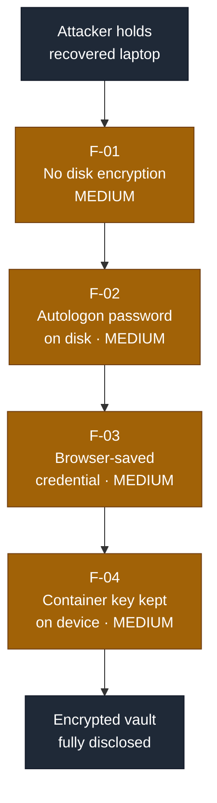
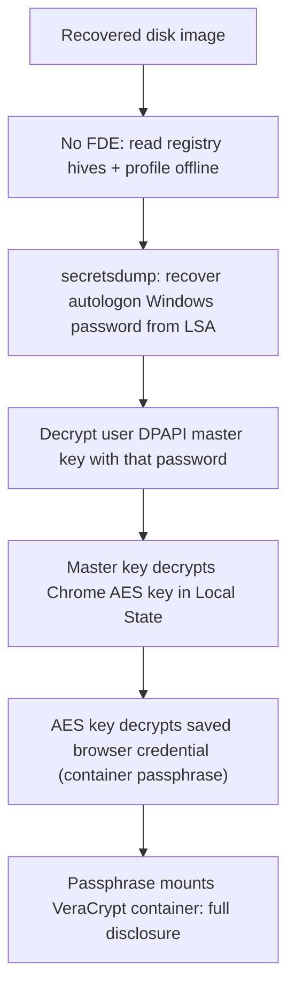

# Security Assessment Report: Lost-Device Data-at-Rest Recovery

**Assessment type:** Forensic data-at-rest recovery from a recovered end-user device
**Environment:** TryHackMe training target ("Management Wants a Word", Hacker Holidays)
**Assessor:** ouroboros-white
**Report date:** 2026-08-10
**Version:** 1.0
**Classification:** Public, portfolio sample

---

> **About this document.** This is a real assessment written to professional
> structure against a **lab target**, not a live client engagement. No production
> system or third party was tested. It models a common commercial scenario, a
> company laptop recovered after being lost or left behind, and asks what an
> attacker in possession of the disk can read from it. It documents the recovery
> as a chain of ordinary configuration weaknesses, with CVSS-rated findings,
> detection analysis, and remediation. Target identifiers and recovered secret
> values are redacted as they would be in a client report; no flags are reproduced.

---

## 1. Executive summary

A staff laptop was recovered after an unplanned checkout and handed in for triage.
Working only from an image of its disk, and without cracking a single password, an
assessor recovered the passphrase to an encrypted container the user had set up to
keep sensitive material private, and opened it.

The container itself was strong. It was protected by full-strength disk
encryption. The problem was never the lock; it was **where the key was kept**. The
user saved the container's passphrase in their web browser, on the same laptop the
container was meant to protect. From there, four ordinary misconfigurations, each
harmless-looking on its own, formed an unbroken path that turned the strong
container into an open one:

1. the disk was **not encrypted**, so the whole user profile and system registry
   could be read straight off the recovered device;
2. **automatic logon** was enabled, which stored the user's Windows password on the
   disk in recoverable form, removing the need to crack anything;
3. that password unlocked the **browser's saved-password store** through Windows'
   built-in protection, exposing the container passphrase in cleartext; and
4. that passphrase **opened the encrypted container**, because the key to the
   strongest control on the device was stored inside the device it locked.

Each finding is rated individually below and lands at **Medium**, because every
step requires physical possession of the device or its image. But **chained, the
real-world outcome is High**: total disclosure of the one thing the user actively
tried to keep secret, from a laptop left in the wrong hands.

### Findings at a glance

| ID | Finding | Severity | CVSS 3.1 |
|----|---------|----------|:--------:|
| F-01 | No full-disk encryption; offline profile and registry recovery | **Medium** | 4.6 |
| F-02 | Automatic-logon password stored in recoverable form (LSA `DefaultPassword`) | **Medium** | 4.6 |
| F-03 | Sensitive credential saved in browser store, recoverable offline via DPAPI | **Medium** | 4.6 |
| F-04 | Encrypted-container passphrase stored on the device it protects | **Medium** | 4.6 |

**Recovery chain at a glance** (severity-highlighted for a management audience):

Each finding carries a **detection analysis**: because offline recovery from a
stolen device generates no telemetry on the victim host, these are expected
preventive and monitoring opportunities on the fleet, not activity observed on the
target.

---

## 2. Scope and rules of engagement

| Item | Detail |
|------|--------|
| **In-scope asset** | A single recovered Windows end-user laptop, supplied as a forensic triage image (registry hives, user profile, browser profile, and one encrypted container file). |
| **Perspective** | Attacker in possession of the device or its disk image. No live network access, no user cooperation, no credentials supplied. |
| **Objective** | Determine what data recoverable from the device, specifically the contents of the user's encrypted container. |
| **Excluded** | Any live system, network, or third party. No destructive action; the container was mounted read-only. |
| **Authorisation** | Performed within the TryHackMe platform terms, which authorise analysis of the provided target. |
| **Window** | 2026-08-10. |

### Target asset

| Attribute | Detail |
|-----------|--------|
| **Hostname / user** | Redacted, as they would be in a client report |
| **Operating system** | Windows |
| **Artifacts supplied** | SAM, SYSTEM, SECURITY registry hives; user `NTUSER.DAT`; Chrome profile (`Login Data`, `Local State`); DPAPI master key; a 100 MB encrypted container |
| **Encryption product** | VeraCrypt (container file) |
| **Assessment date** | 2026-08-10 |

---

## 3. Methodology

The assessment followed a standard digital-forensics workflow: inventory the
supplied artifacts, identify the sensitive target and the controls protecting it,
then reconstruct the offline key-recovery path from lowest-privilege data upward.
Analysis was performed on a copy; the encrypted container was mounted **read-only**
to preserve evidential integrity. Severity is expressed as CVSS v3.1 base score,
and each finding is mapped to a Common Weakness Enumeration (CWE) identifier.
Detection analysis describes expected preventive and monitoring opportunities,
since offline recovery from a held device produces no signal on the device itself.

**Tooling:** `impacket` (`secretsdump`, `dpapi`), an SQLite client, Python
(`cryptography`) for AES-GCM verification, and `cryptsetup` for read-only container
mounting. No custom or destructive tooling was used.

---

## 4. Recovery path

The value of this assessment is the chain, so it is documented as a path before
the findings are detailed individually.

1. **Offline access (F-01).** The disk was not encrypted, so the registry hives
   and the full user profile, including the browser store and DPAPI key material,
   were readable directly from the image without any credential.
2. **Free credential (F-02).** Automatic logon was configured, which stores the
   account password as an LSA secret (`DefaultPassword`). It was recovered from the
   SECURITY and SYSTEM hives, removing any need to crack the login.
3. **Key unwrap (F-03).** The recovered password decrypted the user's DPAPI master
   key, which in turn decrypted the AES key Chrome stores in `Local State`, which
   in turn decrypted the browser's saved password for the container. Windows'
   at-rest protection for browser passwords assumes the attacker cannot become the
   user; possession of the disk plus the autologon secret defeats that assumption.
4. **Full disclosure (F-04).** The recovered browser password was the passphrase
   for the VeraCrypt container. The container opened on the first attempt, because
   the key to the device's strongest control had been stored inside the device
   itself.

Each rung depended on the one before it; none required cracking, insider access,
or any interaction with a live system.

---

## 5. Detailed findings

### F-01: No full-disk encryption enabling offline recovery

| | |
|---|---|
| **Severity** | **Medium** |
| **CVSS 3.1** | 4.6, `AV:P/AC:L/PR:N/UI:N/S:U/C:H/I:N/A:N` |
| **CWE** | CWE-311: Missing Encryption of Sensitive Data |
| **Affected component** | Device disk / operating-system volume |
| **Status** | Open |

**CVSS rationale.** `AV:P` because exploitation requires physical possession of the
device or its image; `C:H` because the entire user profile and system secret store
become readable; `I:N/A:N` as reading an image alters nothing on the source.

**Description.** The system volume was not protected by full-disk encryption. Any
party in possession of the powered-off device or a forensic image can read every
file on it, including registry hives, DPAPI key material, and browser stores,
without authenticating.

**Evidence (sanitised).** The supplied triage image exposed `SAM`, `SYSTEM`,
`SECURITY`, the user's `NTUSER.DAT`, the DPAPI master key, and the complete Chrome
profile as plain files, all of which were consumed by the later findings.

**Business impact.** This is the enabler for the entire chain. With disk encryption
in place, none of the offline artifacts below would have been readable, and the
recovery path never starts.

**Expected detection opportunities.** Preventive, not detective: encryption status
is a fleet-compliance attribute. Endpoint management should report any device whose
volume is unencrypted, and enrolment should block or quarantine non-compliant
machines. Loss of an encrypted device is a compliance event; loss of an
unencrypted one is a breach.

**Remediation.** Enforce full-disk encryption (for example BitLocker with TPM plus
PIN) across the fleet by policy, and treat encryption status as a gating control
for device enrolment and network access.

### F-02: Automatic-logon password stored in recoverable form

| | |
|---|---|
| **Severity** | **Medium** |
| **CVSS 3.1** | 4.6, `AV:P/AC:L/PR:N/UI:N/S:U/C:H/I:N/A:N` |
| **CWE** | CWE-256: Plaintext Storage of a Password |
| **Affected component** | Windows automatic-logon configuration (LSA secrets) |
| **Status** | Open |

**CVSS rationale.** `AV:P` as it is recovered from the on-disk secret store; `C:H`
because the account password unlocks all of that user's DPAPI-protected data;
`I:N/A:N` as recovery is read-only.

**Description.** Automatic logon was enabled. Windows stores the password used for
autologon as an LSA secret (`DefaultPassword`), recoverable offline from the
SECURITY and SYSTEM hives. This converts the user's login password, normally known
only to the user, into an artifact sitting on the disk.

**Evidence (sanitised).** Offline extraction of the LSA secrets returned a
`DefaultPassword` value for the target account. The value is redacted; it matched
the account and successfully decrypted the user's DPAPI master key in F-03.

**Business impact.** Removes the only step in the chain that would otherwise require
password cracking. With the login password in hand for free, every DPAPI-protected
secret in the profile becomes recoverable.

**Expected detection opportunities.** Preventive: the presence of a `DefaultPassword`
autologon configuration is discoverable by configuration audit and should be
flagged fleet-wide. There is no runtime signal, because the secret is simply read
from a held disk.

**Remediation.** Disable automatic logon on all devices. Where a kiosk-style
auto-start is genuinely required, use a dedicated low-privilege account with no
access to sensitive data, never a normal user account.

### F-03: Sensitive credential saved in browser store, recoverable offline

| | |
|---|---|
| **Severity** | **Medium** |
| **CVSS 3.1** | 4.6, `AV:P/AC:L/PR:N/UI:N/S:U/C:H/I:N/A:N` |
| **CWE** | CWE-522: Insufficiently Protected Credentials |
| **Affected component** | Chrome saved-password store (`Login Data`, `Local State`) |
| **Status** | Open |

**CVSS rationale.** `AV:P` because it is recovered from the on-disk profile; `C:H`
because the disclosed credential is high-value (it protects the encrypted
container); `I:N/A:N` as the store is read, not modified.

**Description.** The browser's saved-password feature stored a highly sensitive
credential. Chrome encrypts saved passwords with an AES key that is itself
protected by Windows DPAPI, which is keyed to the user's login. That protection is
designed to stop other users and remote code, but it does not withstand an attacker
who holds the disk and has recovered the login password (F-02). The saved password
is then recoverable in cleartext.

**Evidence (sanitised).** The DPAPI master key (unlocked with the F-02 password)
decrypted the AES key in `Local State`, which decrypted the saved credential in
`Login Data`. The stored blob used Chrome's `v10` AES-256-GCM format. The recovered
username and password are redacted.

**Business impact.** Discloses the container passphrase (see F-04). More broadly,
any credential a user saves in the browser is exposed by this path, including
credentials to corporate systems, which turns a lost laptop into a credential
breach for everything the user saved.

**Expected detection opportunities.** Preventive: policy can disable the browser
password manager on managed devices, or restrict which credentials may be saved.
Detectively, on the corporate side, the disclosed credentials should be treated as
compromised on device loss and rotated, and their reuse from an unexpected location
would be visible in authentication logs.

**Remediation.** Do not store high-value passphrases in a browser password manager.
Disable browser credential storage by policy on managed devices, and provide a
managed enterprise password manager with its own strong master secret for
credentials that must be stored.

### F-04: Encrypted-container passphrase stored on the device it protects

| | |
|---|---|
| **Severity** | **Medium** |
| **CVSS 3.1** | 4.6, `AV:P/AC:L/PR:N/UI:N/S:U/C:H/I:N/A:N` |
| **CWE** | CWE-522: Insufficiently Protected Credentials |
| **Affected component** | VeraCrypt container key management (user practice) |
| **Status** | Open |

**CVSS rationale.** `AV:P` as the chain requires the held device; `C:H` because the
outcome is full disclosure of the container contents; `I:N/A:N` as the container was
mounted read-only and nothing was altered.

**Description.** The container was protected by a strong passphrase and full-strength
encryption, but that passphrase was saved in the browser on the same device the
container was meant to protect. Storing a key inside the thing it locks defeats the
control entirely: any attacker who reaches the device reaches both the lock and its
key together.

**Evidence (sanitised).** The credential recovered in F-03 was supplied as the
container passphrase and mounted the volume on the first attempt (read-only). The
container's own cryptography was never attacked; only its key management failed.

**Business impact.** Complete disclosure of the data the user actively chose to
protect. This is the finding the user would care about most, and it is entirely a
key-management failure rather than a weakness in the encryption product.

**Expected detection opportunities.** Preventive and educational: this is user
practice, addressed by guidance and by removing the enabling feature (F-03) rather
than by monitoring. Where containers hold regulated data, key custody can be made a
policy requirement subject to audit.

**Remediation.** Keep the passphrase for an encrypted container out of any store on
the same device: memorise it, or hold it in a separate managed password vault that
is not unlocked automatically by the device login. A strong lock is only as good as
the custody of its key.

---

## 6. Remediation roadmap

| Priority | Action | Findings |
|:--------:|--------|----------|
| **1 (Now)** | Enforce full-disk encryption across the fleet; gate enrolment on encryption status | F-01 |
| **2 (Now)** | Disable automatic logon; remove any account `DefaultPassword` from the LSA store | F-02 |
| **3 (Now)** | Disable browser credential storage by policy; rotate any credentials saved on the recovered device | F-03 |
| **4 (Now)** | Move container passphrases out of on-device stores into memory or a managed vault | F-04 |
| **5 (Ongoing)** | Treat device loss as a defined incident: rotate exposed credentials and classify by encryption status | All |

---

## 7. Conclusion

The one thing this user tried hardest to protect, an encrypted container, was the
one thing fully disclosed, and not because its encryption was weak. It was
disclosed because the key was kept inside the lock and the device around it was
left open at every layer: unencrypted disk, autologon password on disk, and the
container passphrase saved in the browser. Each of the four weaknesses is
individually minor and would rate Medium at most, yet **any one of them fixed
breaks the chain**: encrypt the disk and nothing is readable; drop autologon and
the login must be cracked; keep the passphrase out of the browser and the container
holds. The lesson mirrors host-based compromise work: no single trusted assumption,
here "the device will stay in the owner's hands", should be enough to hand over the
next layer. Defence in depth for a mobile device means assuming it will be lost, and
making sure that when it is, every layer still has to be defeated on its own.

---

## Appendix A: Severity methodology

Severity is CVSS v3.1 base score. Bands: Critical 9.0 to 10.0, High 7.0 to 8.9,
Medium 4.0 to 6.9, Low 0.1 to 3.9. All findings use the Physical attack vector
(`AV:P`) because each requires possession of the device or its image, which caps the
individual scores in the Medium band. Findings are rated in isolation; the executive
summary notes that the chained real-world outcome, full disclosure of the encrypted
container, carries a High business impact regardless of the individual scores.

## Appendix B: Tooling

`impacket` (`secretsdump`, `dpapi`), SQLite client, Python `cryptography`
(AES-256-GCM verification), `cryptsetup` (read-only VeraCrypt mount). No custom or
destructive tooling was used.
