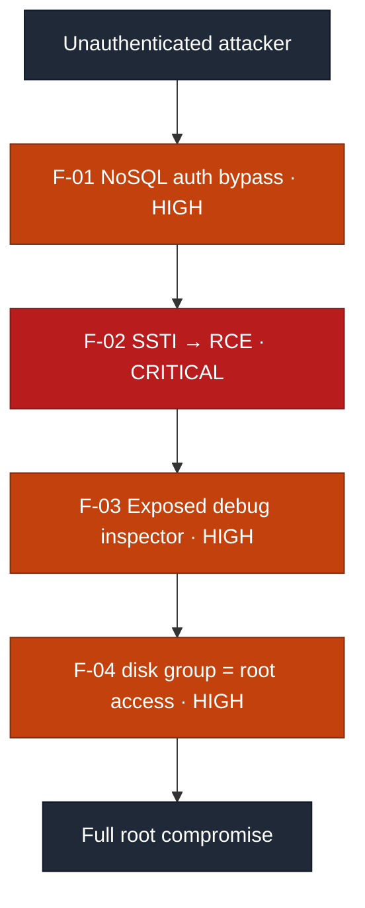
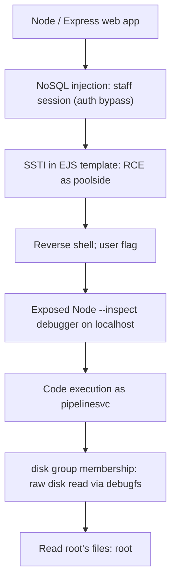

# Security Assessment Report: Single-Host Full Compromise

**Assessment type:** Black-box web-to-root compromise of a single host
**Environment:** TryHackMe training target ("Do Not Disturb", Hacker Holidays)
**Assessor:** ouroboros-white
**Report date:** 2026-08-02
**Version:** 1.0
**Classification:** Public, portfolio sample

---

> **About this document.** This is a real assessment written to professional
> structure against a **lab target**, not a live client engagement. No production
> system or third party was tested. It documents a full web-application-to-root
> compromise of a single host to demonstrate the reporting deliverable: an attack
> path, CVSS-rated findings, detection analysis, and remediation. Target
> identifiers are redacted as they would be in a client report; no flags are
> reproduced.

---

## 1. Executive summary

A single host running a Node.js web application was compromised from an
unauthenticated starting point through to full **root** control. No individual
weakness was exotic; the total compromise came from **four ordinary weaknesses
chained together**, where each one unlocked the next.

An attacker with no credentials could: bypass the login entirely, run arbitrary
commands on the server, move to a second service account, and finally read and
write any file on the system as root. The most serious single issue was a
server-side template injection that granted remote code execution. The most
serious *design* issue was a service account placed in a group that grants
raw disk access, which is effectively root.

While each finding is rated individually below, **the combined real-world
severity is Critical**: the chain results in complete compromise of the host and
everything on it.

### Findings at a glance

| ID | Finding | Severity | CVSS 3.1 |
|----|---------|----------|:--------:|
| F-01 | NoSQL injection authentication bypass | **High** | 7.5 |
| F-02 | Server-side template injection leading to remote code execution | **Critical** | 9.8 |
| F-03 | Exposed Node.js debug inspector enabling lateral movement | **High** | 7.8 |
| F-04 | Service account with root-equivalent group membership (`disk`) | **High** | 7.8 |

**Attack chain at a glance** (severity-highlighted for a management audience):

Each finding also carries a **detection analysis**: the telemetry a monitored
environment would generate and why the activity would or would not be caught.
As with lab targets generally, these are expected detection opportunities rather
than observed fact, because the host carries no instrumentation of its own.

---

## 2. Scope and rules of engagement

| Item | Detail |
|------|--------|
| **In-scope asset** | A single host exposing SSH (22) and a Node.js/Express web application (80). |
| **Perspective** | External, black-box, unauthenticated. No credentials or prior knowledge supplied. |
| **Objective** | Achieve and demonstrate the highest level of access obtainable (root). |
| **Excluded** | Denial-of-service, destructive actions, and any target outside the named host. |
| **Authorisation** | Performed within the TryHackMe platform terms, which authorise exploitation of the provided target. |
| **Window** | 2026-08-02. |

### Target asset

| Attribute | Detail |
|-----------|--------|
| **Hostname** | Redacted, as it would be in a client report |
| **IP address** | Redacted. Single in-scope host. |
| **Operating system** | Linux |
| **Exposed services** | 22/tcp SSH; 80/tcp HTTP (Node.js / Express) |
| **Assessment date** | 2026-08-02 |

---

## 3. Methodology

The assessment followed a standard offensive workflow aligned to the Penetration
Testing Execution Standard (PTES) and, for the web layer, the OWASP Web Security
Testing Guide (WSTG): reconnaissance, enumeration, vulnerability analysis,
exploitation, post-exploitation and privilege escalation, then reporting.
Severity is expressed as CVSS v3.1 base score, and each finding is mapped to a
Common Weakness Enumeration (CWE) identifier. Detection analysis describes
expected detection opportunities, since the target is not instrumented.

**Tooling:** `nmap`, `gobuster`, browser developer tools, `node`, standard Linux
utilities (`ss`, `systemctl`, `debugfs`). No custom or destructive tooling was
used.

---

## 4. Attack path

The value of this engagement is the chain, so it is documented as a path before
the findings are detailed individually.

1. **Entry (F-01).** The login was defeated with a NoSQL operator injection,
   granting an authenticated session in a privileged "staff" role without a
   password.
2. **Code execution (F-02).** The staff area exposed a template editor using a
   named template engine. A template-injection payload escalated to arbitrary
   command execution as the web service account, `poolside`. A reverse shell was
   established and the user-level objective recovered.
3. **Lateral movement (F-03).** A background service ran as a second account,
   `pipelinesvc`, with the Node.js debug inspector left listening on localhost.
   The inspector was abused to execute code as `pipelinesvc`.
4. **Root (F-04).** `pipelinesvc` was a member of the `disk` group, which grants
   raw read/write to the block devices. Using `debugfs` against the root
   partition, files owned by root were read directly off the disk, bypassing
   filesystem permissions entirely, achieving the root-level objective.

Each rung depended on the one before it; none required insider access.

---

## 5. Detailed findings

### F-01: NoSQL injection authentication bypass

| | |
|---|---|
| **Severity** | **High** |
| **CVSS 3.1** | 7.5, `AV:N/AC:L/PR:N/UI:N/S:U/C:H/I:N/A:N` |
| **CWE** | CWE-943: Improper Neutralization of Special Elements in Data Query Logic |
| **Affected component** | Web application login |
| **Status** | Open |

**CVSS rationale.** `AV:N/PR:N` because the login is defeated over the network with
no credentials; `C:H` because it grants a privileged session, with `I:N/A:N` as the
bypass alone neither modifies nor denies data.

**Description.** The login passed request parameters into a datastore query
without constraining their type. Supplying the password as a query operator
object rather than a string caused the query to match a user regardless of the
password value, authenticating the attacker as a known privileged account.

**Evidence (sanitised).** A request body of the form
`username=<known-user>&password[$ne]=1` ("password is not 1") authenticated
successfully and returned a valid session, granting access to a staff-only area.

**Business impact.** Complete bypass of authentication. Any anonymous user could
assume a privileged application role, which in this case was the gateway to full
server compromise (F-02).

**Expected detection opportunities.** Authentication requests where the username
or password parameter arrives as an object or contains query operators
(`[$ne]`, `[$gt]`, `[$regex]`) are a high-fidelity indicator; a WAF or
application-layer control can alert on non-string authentication inputs. Not
observed here because the app performed no such logging.

**Remediation.** Cast authentication inputs to strings before querying, and
reject any request where they are not the expected primitive type. Validate and
sanitise all user input used in queries.

### F-02: Server-side template injection leading to remote code execution

| | |
|---|---|
| **Severity** | **Critical** |
| **CVSS 3.1** | 9.8, `AV:N/AC:L/PR:N/UI:N/S:U/C:H/I:H/A:H` |
| **CWE** | CWE-1336: Improper Neutralization of Special Elements Used in a Template Engine |
| **Affected component** | Staff booking-confirmation template feature |
| **Status** | Open |

**CVSS rationale.** `PR:N` in effect because the staff-role requirement is nullified
by F-01; `C:H/I:H/A:H` because template injection yields full command execution on
the host.

**Description.** A staff feature rendered a user-supplied template through a
server-side template engine. Because the engine compiles templates to executable
code, attacker-supplied template syntax was evaluated on the server, escalating
to arbitrary command execution.

**Evidence (sanitised).** A test expression returned its evaluated result
(confirming server-side evaluation), after which a payload reaching the runtime's
process module executed operating-system commands as the web service account.
The staff-role requirement is nullified by F-01, so this is effectively
unauthenticated, hence the Critical rating.

**Business impact.** Full remote code execution on the host as the web service
account: an attacker can read and alter application data, pivot within the
network, and establish persistence.

**Expected detection opportunities.** Two layers. At the application edge,
template payloads (engine control sequences, references to runtime internals such
as the process or child-process modules) submitted to the template field are
detectable and blockable. At the host, the highest-fidelity signal is the web
service process spawning a shell or other child process, an anomalous
process-lineage event that endpoint detection flags reliably.

**Remediation.** Never render user-controlled templates. Treat user input as data
to be inserted into a fixed template, never as template code. If dynamic
templating is unavoidable, use a sandboxed, logic-less engine.

### F-03: Exposed Node.js debug inspector enabling lateral movement

| | |
|---|---|
| **Severity** | **High** |
| **CVSS 3.1** | 7.8, `AV:L/AC:L/PR:L/UI:N/S:U/C:H/I:H/A:H` |
| **CWE** | CWE-489: Active Debug Code |
| **Affected component** | Background telemetry service (`pipelinesvc`) |
| **Status** | Open |

**CVSS rationale.** `AV:L/PR:L` because abusing the localhost inspector requires the
existing foothold from F-02; `C:H/I:H/A:H` because a debugger permits arbitrary code
execution inside the target process.

**Description.** A background service ran the Node.js runtime with the debug
inspector enabled and listening on localhost. A debugger, by design, permits
arbitrary code execution inside the target process, so an exposed inspector is a
code-execution interface for any local user who can reach the port.

**Evidence (sanitised).** The service definition enabled the inspector on a
localhost port. From the F-02 foothold, the runtime's own debug client was used
to attach and evaluate code inside the process, which executed as the service's
account, `pipelinesvc`.

**Business impact.** Lateral movement from the web service account to a second
service account. "Localhost only" provided no protection because the attacker
already had a foothold on the host.

**Expected detection opportunities.** Production services should never run with the
inspector enabled; its presence is itself the finding, detectable by
configuration audit. At runtime, a debug client attaching to the inspector port,
or the service process spawning unexpected children, are detectable events.

**Remediation.** Never enable the debug inspector in production. Remove
inspector flags from service definitions, and do not rely on localhost binding as
an access control.

### F-04: Service account with root-equivalent group membership (`disk`)

| | |
|---|---|
| **Severity** | **High** |
| **CVSS 3.1** | 7.8, `AV:L/AC:L/PR:L/UI:N/S:U/C:H/I:H/A:H` |
| **CWE** | CWE-250: Execution with Unnecessary Privileges |
| **Affected component** | `pipelinesvc` service account |
| **Status** | Open |

**CVSS rationale.** `AV:L/PR:L` because the group membership is abused from an
existing foothold; `C:H/I:H/A:H` because raw disk access is equivalent to root-level
read and write of every file on the host.

**Description.** The `pipelinesvc` account was a member of the `disk` group, which
grants raw read/write access to the block devices. This access sits beneath the
filesystem permission layer, so it is equivalent to root-level file access
regardless of individual file ownership.

**Evidence (sanitised).** With code execution as `pipelinesvc` (F-03), the account
was confirmed to be in the `disk` group. A filesystem-debugging utility was used
against the root partition to read files owned exclusively by root, directly off
the raw device, bypassing their restrictive permissions.

**Business impact.** Effective root. An attacker can read every file on the system
(including credential stores and secrets) and write to any file, which trivially
extends to full and persistent root control.

**Expected detection opportunities.** This is primarily a **preventive** finding:
a service account in a root-equivalent group is a misconfiguration caught by
periodic privilege audit, not a live signal. Detectively, raw block-device access
by a non-root account, or invocation of a filesystem-debugging tool by a service
account, are anomalous and can be alerted on with kernel audit rules.

**Remediation.** Apply least privilege: service accounts must never be members of
root-equivalent groups such as `disk`, `docker`, `lxd`, or `shadow`. Audit group
membership and remove any that is not strictly required.

---

## 6. Remediation roadmap

| Priority | Action | Findings |
|:--------:|--------|----------|
| **1 (Now)** | Stop rendering user-controlled templates; treat template input as data | F-02 |
| **2 (Now)** | Type-check and cast authentication inputs; reject query operators | F-01 |
| **3 (Now)** | Remove the debug inspector from the production service definition | F-03 |
| **4 (Now)** | Remove the service account from the `disk` group; audit all group membership | F-04 |
| **5 (Ongoing)** | Establish least-privilege review and input-handling standards across services | All |

---

## 7. Conclusion

This host was taken from anonymous to root through four commonplace weaknesses,
none sophisticated, chained so that each unlocked the next: a login that trusted
raw input, a feature that compiled user input as code, a debug port left open,
and a service account granted more privilege than it needed. The unifying lesson
is that **no single trusted assumption should be enough to hand over the next
level of access.** Defence in depth means breaking the chain at any one link, and
every link here was individually cheap to fix.

---

## Appendix A: Severity methodology

Severity is CVSS v3.1 base score. Bands: Critical 9.0 to 10.0, High 7.0 to 8.9,
Medium 4.0 to 6.9, Low 0.1 to 3.9.

This finding set illustrates a limitation worth stating, because the highest score
in the table is not the most useful number in it. F-02 already rates Critical
(9.8) on its own, so the chain cannot raise the headline severity; what the chain
changes is the two findings after it. F-03 and F-04 are scored `AV:L`, which
prices them as though an attacker must first obtain local access. On this host
they do not: F-02 supplies it unauthenticated and in one step. Read in isolation
those two look like post-compromise hardening items, and read in sequence they are
the reason a web flaw becomes root. Where the base score and the attack path
disagree in that way, the remediation roadmap follows the path.

## Appendix B: Tooling

`nmap`, `gobuster`, browser developer tools, `node` (debug client), `ss`,
`systemctl`, `debugfs`. No custom or destructive tooling was used.
