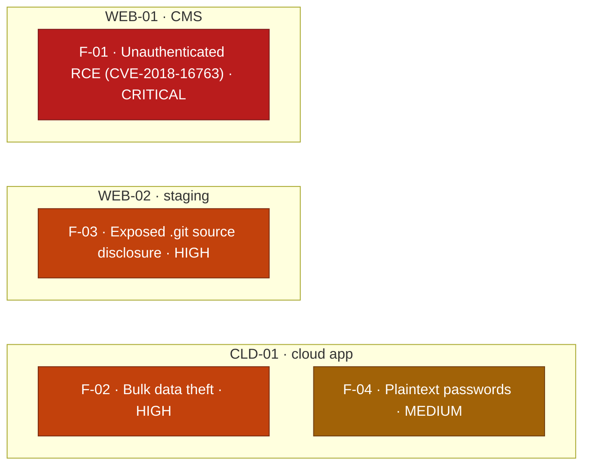

# Security Assessment Report: Training Lab Environment

**Assessment type:** Black-box web application & cloud security assessment
**Environment:** TryHackMe training targets (self-directed practice)
**Assessor:** ouroboros-white
**Report date:** 2026-08-01
**Version:** 1.0
**Classification:** Public

---

> **About this document.** This is a real assessment against **lab targets**,
> written to professional structure. All reconnaissance, exploitation, and
> evidence collection described here was carried out by me against those targets.
> Nothing in it is hypothetical, and none of it is reproduced from a walkthrough.
> It is not a live client engagement, and no production system or third party was
> tested. It exists to demonstrate the reporting deliverable (scoping, findings,
> severity rating, evidence, and remediation) using vulnerabilities I identified
> and exploited in a training environment. Target hostnames and addresses are
> redacted as they would be in a client report; no flags or answers are
> reproduced.

---

## 1. Executive summary

Three lab web/cloud targets were assessed from an unauthenticated, external
perspective. Every target was fully compromised, and in each case the root cause
was a control that was missing or misconfigured rather than a novel or
sophisticated attack.

The most serious issue was an application running software with a **publicly
known, four-year-old remote code execution flaw** that granted full control of
the server to any anonymous visitor. A second target leaked its entire source
code and version history to the internet. A third, a cloud-hosted application,
handed every anonymous visitor working credentials that were permitted to read
the entire customer database, including personal data stored in plaintext.

None of the findings required insider access, valid accounts, or user
interaction. All are exploitable by an unauthenticated attacker on the internet
using free, publicly documented tools. The common theme is **trusting the
client, the network boundary, or the obscurity of a path to enforce security
that was never enforced on the server side.**

Each finding also carries a **detection analysis**: the observable artifacts a
monitored environment would generate, the logic that would catch the attack, and
why it would or would not be caught. These are expected detection opportunities
rather than observed fact, because the lab targets carry no instrumentation of
their own.
The intent is to document both halves of the exchange, the attack and the
defence that should meet it.

### Findings at a glance

| ID | Finding | Severity | CVSS 3.1 |
|----|---------|----------|:--------:|
| F-01 | Unauthenticated remote code execution in end-of-life CMS (CVE-2018-16763) | **Critical** | 9.8 |
| F-02 | Broken access control: over-permissioned cloud role enables bulk data theft | **High** | 7.5 |
| F-03 | Source code and version-control history disclosure (exposed `.git`) | **High** | 7.5 |
| F-04 | Sensitive data (passwords) stored in plaintext | **Medium** | 5.3 |

**Findings by target** (severity-highlighted for a management audience). Unlike a
single-host compromise, these findings are **independent** across three separate
targets, not one chain:



---

## 2. Scope and rules of engagement

| Item | Detail |
|------|--------|
| **In-scope assets** | `WEB-01`: CMS-based web application (Apache/HTTP) · `WEB-02`: staging web application (HTTP/8080) · `CLD-01`: cloud-hosted static web application (object storage + serverless identity/data services) |
| **Perspective** | External, black-box, unauthenticated. No credentials or prior knowledge supplied. |
| **Permitted** | Reconnaissance, enumeration, exploitation of identified vulnerabilities, and demonstration of impact sufficient to prove the finding. |
| **Excluded** | Denial-of-service, destructive actions, social engineering of platform staff, and pivoting outside the named targets. |
| **Authorisation** | Testing performed within the TryHackMe platform's terms of use, which authorise exploitation of the provided lab targets. |
| **Window** | 2026-07-28 to 2026-08-01. |

### Target asset inventory

| Asset | Type / stack | Exposed services | Platform |
|-------|--------------|------------------|----------|
| WEB-01 | CMS web application (FUEL CMS 1.4) | 80/tcp HTTP (Apache 2.4.41) | Linux (LAMP) |
| WEB-02 | Staging web application | 8080/tcp HTTP | Linux |
| CLD-01 | Cloud static web app (object storage + serverless identity/data) | HTTPS (cloud-hosted) | AWS (Cognito + DynamoDB) |

Hostnames and addresses redacted as they would be in a client report. Assessment
window 2026-07-28 to 2026-08-01.

---

## 3. Methodology

The assessment followed a standard offensive workflow aligned to the Penetration
Testing Execution Standard (PTES) and, for the web layer, the OWASP Web Security
Testing Guide (WSTG):

1. **Reconnaissance:** identify live services, ports, and technologies.
2. **Enumeration:** map application surface, content, and platform behaviour;
   fingerprint software and versions.
3. **Vulnerability analysis:** map findings to known weaknesses (CVE/CWE) and to
   logic or configuration flaws.
4. **Exploitation:** prove impact with the least intrusive action that
   demonstrates the finding.
5. **Reporting:** rate, evidence, and provide remediation for each finding.

**Detection analysis.** Because this assessment is written to cover offensive
*and* defensive understanding, each finding additionally documents the telemetry
a monitored environment would produce and the detection logic that would catch
the attack. The lab targets are not instrumented, so this analysis is deliberately
framed as expected detection opportunities (what a defender *would* observe), never as events that were
actually seen. Distinguishing a claim about a real log from a reasoned model of
one is itself a discipline the report intends to demonstrate.

**Tooling:** `nmap`, `gobuster`, `git-dumper`, `searchsploit` / Exploit-DB, the
AWS CLI, and standard browser developer tools. Severity is expressed using CVSS
v3.1 base scores; each finding is also mapped to a Common Weakness Enumeration
(CWE) identifier.

### ATT&CK technique mapping

Attacker behaviour is mapped to MITRE ATT&CK (Enterprise) so the work can be read
against a defender's coverage matrix. Unlike a single-host chain, these are three
independently assessed targets, so the mapping is presented as one table per
target rather than as a single sequence.

**WEB-01** (end-of-life CMS)

| Stage | Finding | Tactic | Technique |
|---|---|---|---|
| Port, service and version fingerprinting | n/a | Reconnaissance | T1595.002 Active Scanning: Vulnerability Scanning |
| Exploiting CVE-2018-16763 in an end-of-life CMS | F-01 | Initial Access | T1190 Exploit Public-Facing Application |
| Commands run on the host through the exploit | F-01 | Execution | T1059.004 Command and Scripting Interpreter: Unix Shell |

**CLD-01** (client-side cloud application)

| Stage | Finding | Tactic | Technique |
|---|---|---|---|
| Collecting the credentials the application issues to anonymous visitors | F-02 | Credential Access | T1552.001 Unsecured Credentials: Credentials In Files |
| Authenticating to the cloud API with those credentials | F-02 | Defense Evasion | T1078.004 Valid Accounts: Cloud Accounts |
| Establishing which identity the credentials actually hold | F-02 | Discovery | T1087.004 Account Discovery: Cloud Account |
| Full-table read of the managed database | F-02 | Collection | T1530 Data from Cloud Storage |

**WEB-02** (exposed version-control repository)

| Stage | Finding | Tactic | Technique |
|---|---|---|---|
| Content discovery locating the exposed repository | F-03 | Reconnaissance | T1595.003 Active Scanning: Wordlist Scanning |
| Reconstructing the working tree and commit history | F-03 | Collection | T1213.003 Data from Information Repositories: Code Repositories |
| Secrets recovered from history that a later commit had "removed" | F-03 | Credential Access | T1552.001 Unsecured Credentials: Credentials In Files |

Reconnaissance produced no reportable finding, so those rows carry `n/a` in the
Finding column rather than being tied to one.

Three mappings need their reasoning stated.

**F-02 splits across four techniques** because the finding is one weakness but
four distinct behaviours, and they are not detected by the same telemetry. The
credential collection happens in the victim's browser and is invisible to the
cloud provider. The authentication and the identity check appear in
management-plane logs. The full-table read appears only in data-plane logs, which
are off by default. That split is the entire argument of the detection analysis in
F-02, and the mapping is what makes it legible to a defender.

**T1530 is an imperfect fit for the database read.** ATT&CK describes it as data
from cloud storage, and the target here is a managed NoSQL database rather than an
object store. T1213 Data from Information Repositories is the alternative reading.
T1530 is used because the access path was the cloud provider's own API with cloud
credentials, which is the behaviour a defender would be hunting.

**F-04 is deliberately absent from the table.** Plaintext password storage is a
data-protection failure rather than something an adversary does, so it has no
attacker technique of its own. The technique it would enable is T1110.004 Brute
Force: Credential Stuffing, reusing the recovered passwords against other
services, and that was neither performed nor in scope: those services belong to
third parties and testing them would sit outside the authorisation this assessment
was carried out under. It is named here rather than tabulated because this table
records what was done, and every row in it is an action taken against an in-scope
target.

---

## 4. Detailed findings

Findings are ordered by severity, highest first.

---

### F-01: Unauthenticated remote code execution in end-of-life CMS

| | |
|---|---|
| **Severity** | **Critical** |
| **CVSS 3.1** | 9.8, `AV:N/AC:L/PR:N/UI:N/S:U/C:H/I:H/A:H` |
| **CWE** | CWE-94: Improper Control of Generation of Code ('Code Injection') |
| **Reference** | CVE-2018-16763 |
| **Affected asset** | WEB-01 |
| **Status** | Open |

**CVSS rationale.** `AV:N/PR:N/UI:N` because a published exploit runs
unauthenticated over the network with no user interaction; `C:H/I:H/A:H` because it
yields full command execution on the host.

**Description.**
Service enumeration identified the application as **FUEL CMS version 1.4**, with
the version number printed directly in the served pages. This release is affected
by CVE-2018-16763, a publicly documented unauthenticated remote code execution
vulnerability: the `pages` module passes attacker-controlled input from the
`filter` parameter into an unsafe dynamic PHP function call, allowing arbitrary
commands to run on the server. A working exploit has been published on Exploit-DB
since 2018.

**Evidence (sanitised).**
```
# Service and version fingerprinting
nmap -sC -sV -p- <target>
#   80/tcp  http  Apache 2.4.41
#   http-title: Welcome to FUEL CMS         -> application identified
#   http-robots.txt: /fuel/                 -> admin panel located
# Application self-reported version: 1.4

# Located and retrieved a public exploit
searchsploit Fuel CMS 1.4
searchsploit -m linux/webapps/47138.py
```
The published exploit required adaptation before use (a hardcoded target,
a leftover proxy configuration, and Python 2 syntax), which is typical of
public proof-of-concept code and part of the assessor's job. Once corrected, the
exploit returned an interactive command prompt on the target. Running `id`
returned command output disclosing internal server paths
(`/var/www/html/...`), confirming code execution as the web service account.

**Business impact.**
Full compromise of the web server by any anonymous internet user. An attacker
could read or alter all application data, deface or replace the site, harvest
credentials, use the host as a pivot into the internal network, or deploy
ransomware. This is the highest-impact class of finding.

**Expected detection opportunities.**
The target is not instrumented; the following is what a monitored production
environment *would* observe.
- **Network layer:** web-server access logs would record requests to
  `/fuel/pages/select/?filter=...` carrying PHP function names (`system`,
  `exec`, `passthru`) in the parameter, a high-fidelity indicator. A published
  IDS/WAF signature for CVE-2018-16763 would fire on this.
- **Host layer (highest fidelity):** endpoint telemetry would show the web-server
  process (`apache`/`php-fpm`) spawning a shell and then commands such as `id`.
  A web server becoming the parent of a shell process is one of the most reliable
  remote-code-execution tells there is; EDR classifies it as a process-lineage
  anomaly.
- **Why it evaded here:** a stock LAMP host with no endpoint agent and no
  monitoring of its access logs. This activity is easily identifiable if it is
  being observed; here, nothing was.

**Remediation.**
- **Immediate:** take the affected version out of service or restrict access
  while remediating. FUEL CMS 1.4 is end-of-life; the fix is CMS-side, not
  configurable away.
- **Correct:** upgrade to a supported, patched release of the platform.
- **Defence in depth:** restrict the `/fuel` administrative interface to trusted
  networks, and place a web application firewall in front of the application to
  blunt exploitation of known CVEs.
- **Process:** establish software asset inventory and patch management so
  end-of-life components are identified and replaced before they are exploited.

---

### F-02: Broken access control (over-permissioned cloud role enables bulk data theft)

| | |
|---|---|
| **Severity** | **High** |
| **CVSS 3.1** | 7.5, `AV:N/AC:L/PR:N/UI:N/S:U/C:H/I:N/A:N` |
| **CWE** | CWE-732: Incorrect Permission Assignment for Critical Resource |
| **Affected asset** | CLD-01 |
| **Status** | Open |

**CVSS rationale.** `PR:N` because the application issues working credentials to any
anonymous visitor; `C:H` for full disclosure of the customer database, with `I:N/A:N`
as the role reads but does not modify data.

**Description.**
`CLD-01` is a static web application served from cloud object storage. It has no
login: on arrival, every visitor is silently issued **temporary but genuine
cloud credentials** via an unauthenticated serverless identity pool, so the
browser can read that visitor's own record from a managed NoSQL database.

Because the application is entirely client-side, its logic is fully visible in
the served JavaScript. Review of that code showed the app only ever requests the
caller's *own* record, but that restriction lives only in the JavaScript. The
underlying credentials were granted a database **`Scan`** permission, which
returns the *entire* table. The access-control decision was made in code the
attacker controls, not in the server-side permissions that actually govern the
data.

**Evidence (sanitised).**
```bash
# The app hands unauthenticated visitors real temporary credentials
aws cognito-identity get-id \
    --identity-pool-id <pool-id> --region <region> --no-sign-request
aws cognito-identity get-credentials-for-identity \
    --identity-id <identity-id> --region <region> --no-sign-request

# Confirm which identity the loaded credentials actually hold
aws sts get-caller-identity

# The role permits a full-table Scan, not just a single-record read
aws dynamodb scan --table-name <table> --region <region>
```
The `scan` returned every guest record in the table. Each record contained a
name, email address, phone number, GPS coordinates, free-text notes, and a
password (see F-04).

**Business impact.**
Complete disclosure of all customer personal data to any anonymous visitor. This
is a reportable data breach under data-protection regulation (e.g. UK GDPR),
carrying regulatory, legal, and reputational consequences well beyond the
technical fix.

**Expected detection opportunities.**
The lab account has no monitoring configured; the following are expected detection opportunities.
- **Credential issuance (logged by default):** the Cognito `GetId` and
  `GetCredentialsForIdentity` calls are *management-plane* events, which
  CloudTrail records out of the box. The attacker obtaining guest credentials is
  therefore visible in the default audit trail.
- **The data theft (not logged by default):** the `dynamodb:Scan` that reads
  every record is a *data-plane* event. CloudTrail does not record data events
  unless they are explicitly enabled, because the category is too high-volume to
  log by default. So the read that actually causes the breach leaves no native
  audit trail.
- **Why GuardDuty is unlikely to help either:** it does not observe DynamoDB
  reads (DynamoDB is not one of its data sources), the source IP would be an
  ordinary shared address rather than a flagged one, and a mass-issued anonymous
  identity has no behavioural baseline to deviate from. The residual signal is
  resource-level: a read-capacity spike on the table, visible in CloudWatch
  metrics without any data-event logging.
- **Detection logic:** deterministic detection requires data-event logging with
  an alarm on `Scan` by the unauthenticated identity (a `Scan`, where the
  application only ever legitimately issues `GetItem`, is itself the anomaly),
  backed by a CloudWatch alarm on anomalous read capacity for the table.
- **Why it evaded here:** the account records management events only, with no
  data-event logging, no metric alarms, and no GuardDuty.

**Remediation.**
- Scope the unauthenticated role to **least privilege**: permit only a
  single-record read (`GetItem`) on the caller's own key, never a table-wide
  `Scan`.
- Enforce per-identity row isolation server-side using fine-grained access
  control (a `dynamodb:LeadingKeys` condition tied to the identity), so the data
  layer, not the browser, is what prevents one visitor reading another's row.
- Reconsider whether unauthenticated users should reach personal data at all.
  Sensitive records should sit behind authentication.

---

### F-03: Source code and version-control history disclosure

| | |
|---|---|
| **Severity** | **High** |
| **CVSS 3.1** | 7.5, `AV:N/AC:L/PR:N/UI:N/S:U/C:H/I:N/A:N` |
| **CWE** | CWE-527: Exposure of Version-Control Repository to an Unauthorized Control Sphere |
| **Affected asset** | WEB-02 |
| **Status** | Open |

**CVSS rationale.** `PR:N` because the exposed `.git` is fetchable anonymously;
`C:H` for full source and commit-history disclosure, with no direct integrity or
availability impact.

**Description.**
`WEB-02` was deployed by copying the entire project working directory to the web
root, including its `.git` version-control folder, which was left
web-accessible. Content discovery confirmed `/.git/HEAD` returned HTTP 200. An
exposed `.git` directory allows an attacker to reconstruct the **full source code
and its entire commit history**, not just the current files but everything ever
committed, including secrets that were "removed" in a later commit but never
purged from history.

**Evidence (sanitised).**
```
# Content discovery flagged the exposed repository
gobuster dir -u http://<target>:8080 -w <wordlist> -x php,txt,zip,bak,git
#   /.git        (Status: 200)
#   /.git/HEAD   (Status: 200)

# Reconstruct the full working tree and history from the exposed objects
git-dumper http://<target>:8080/.git ./loot
```
The repository was reconstructed locally, disclosing the application source and
its history.

**Business impact.**
Full source disclosure hands an attacker a map of the application's logic and any
secrets (API keys, database credentials, tokens) committed to history, greatly
accelerating further attacks. The information is often as valuable as an
exploitable bug because it turns black-box guessing into white-box certainty.

**Expected detection opportunities.**
Expected detection opportunities, as the target is uninstrumented.
- **Network layer:** `git-dumper` issues hundreds of sequential requests to
  `/.git/HEAD`, `/.git/config`, and `/.git/objects/...`. A burst of HTTP 200s to
  `.git/*` paths from a single source is an unmistakable access-log pattern.
- **Detection logic:** alert on any successful (`200`) response for `/.git/*` or
  other dotfiles, and on request-rate spikes to a single dotfolder.
- **Why it evaded here:** no access-log monitoring and no server-level block on
  `.git/`. Adding that block (see remediation) is both the fix and the control
  that would generate the denied requests a defender could alert on.

**Remediation.**
- Never deploy the `.git` directory to production. Deploy **build artifacts**,
  not the repository working tree.
- As a backstop, block web access to `.git/` (and similar dotfolders) at the web
  server or CDN.
- Rotate any secret ever committed to the repository history; assume anything in
  history is compromised.

---

### F-04: Sensitive data stored in plaintext

| | |
|---|---|
| **Severity** | **Medium** |
| **CVSS 3.1** | 5.3, `AV:N/AC:L/PR:N/UI:N/S:U/C:L/I:N/A:N` |
| **CWE** | CWE-256: Plaintext Storage of a Password |
| **Affected asset** | CLD-01 |
| **Status** | Open |

**CVSS rationale.** `C:L` in isolation because it is a data-at-rest weakness that
requires another flaw (F-02) to reach the data; its true severity is the
account-takeover amplification the summary notes.

**Description.**
The customer records disclosed via F-02 stored user passwords in **plaintext**,
alongside other personal data. This is an independent weakness with a different
owner and fix from the access-control issue: even if F-02 were fully remediated,
storing recoverable passwords remains a serious data-protection failure.

**Business impact.**
Rated Medium in isolation, but it **amplifies F-02 to account-takeover severity**.
Because people reuse passwords, a plaintext password dump enables attacks against
victims' accounts on *other* services, extending harm far beyond this
application. The combination of F-02 and F-04 is the most damaging real-world
outcome in this assessment.

**Expected detection opportunities.**
Unlike the findings above, this has no live attack signature to detect: it is a
data-at-rest weakness, not an action an attacker performs. Its controls are
therefore **preventive and audit-based**, not detective: automated secret and
credential scanning across code and data stores, and a data-classification review
that would flag passwords held as recoverable fields. Knowing which findings can
be *detected* and which can only be *prevented* is part of assessing them
correctly.

**Remediation.**
- Never store passwords recoverably. Store only a **salted hash** using a modern,
  deliberately slow password-hashing function (e.g. Argon2id or bcrypt).
- Treat this as a design-level control: authentication data and other sensitive
  fields should be classified and handled to a data-protection standard, not
  stored as ordinary attributes.

---

## 5. Remediation roadmap

| Priority | Action | Findings |
|:--------:|--------|----------|
| **1 (Now)** | Take the end-of-life CMS out of service / restrict it, then upgrade | F-01 |
| **2 (Now)** | Restrict the cloud role to least privilege; remove table-wide `Scan` | F-02 |
| **3 (Now)** | Remove `.git` from the web root; rotate any secrets in history | F-03 |
| **4 (Next)** | Re-hash all stored passwords; classify and protect sensitive fields | F-04 |
| **5 (Ongoing)** | Establish asset inventory, patch management, and a "server-side is the only enforcement boundary" review standard | All |

---

## 6. Conclusion

Every target fell to a known, preventable weakness rather than a novel exploit.
The unifying lesson across all four findings is a single principle: **security
must be enforced on the server side, at the trust boundary you control.** F-01
trusted an unpatched component; F-02 trusted client-side JavaScript to limit what
server-side credentials could do; F-03 trusted that an unlinked path would stay
secret; F-04 trusted that data would never be read. In each case the missing
control was cheap and well understood; the cost was only ever paid because it
was assumed rather than implemented.

---

## Appendix A: Severity methodology

Severity is CVSS v3.1 base score. Bands: Critical 9.0–10.0, High 7.0–8.9,
Medium 4.0–6.9, Low 0.1–3.9. Business-impact narrative is provided per finding
because a base score alone does not capture regulatory or reputational
consequences (notably the personal-data exposure in F-02/F-04).

## Appendix B: Tooling

`nmap`, `gobuster`, `git-dumper`, `searchsploit` / Exploit-DB, AWS CLI, browser
developer tools. No custom or destructive tooling was used; the single public
exploit employed was reviewed and adapted before execution.
