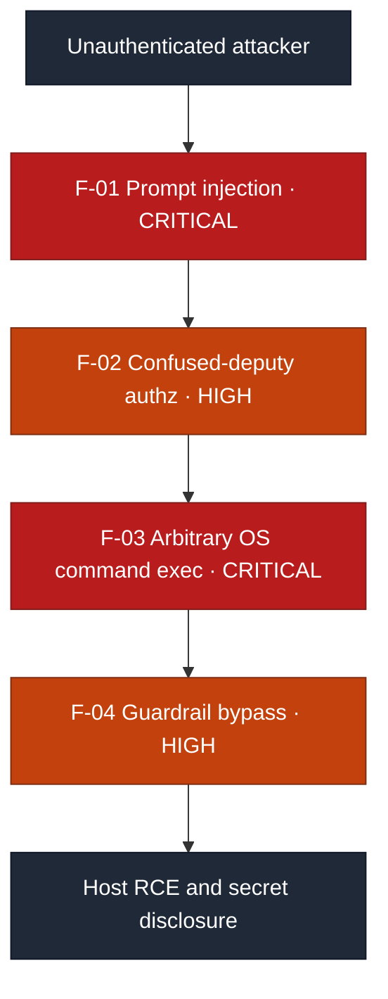
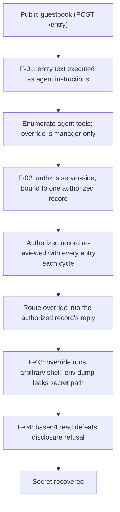

# Security Assessment Report: LLM Agent Prompt Injection to Host Compromise

**Assessment type:** Black-box security assessment of an LLM-backed web application
**Environment:** TryHackMe training target ("The Guestbook", Hacker Holidays)
**Assessor:** ouroboros-white
**Report date:** 2026-08-08
**Version:** 1.0
**Classification:** Public

---

> **About this document.** This is a real assessment against a **lab target**,
> written to professional structure. All reconnaissance, exploitation, and
> evidence collection described here was carried out by me against that target.
> Nothing in it is hypothetical, and none of it is reproduced from a walkthrough.
> It is not a live client engagement, and no production system or third party was
> tested. It documents the compromise of an LLM-backed
> web application, from an unauthenticated position through to arbitrary command
> execution on the host and recovery of a protected secret, to demonstrate the
> reporting deliverable for **AI/LLM systems**: an attack path, CVSS-rated
> findings, detection analysis, and remediation. Target identifiers and secrets
> are redacted as they would be in a client report; no flags are reproduced.

---

## 1. Executive summary

A public web application fronted by an LLM "concierge" agent was compromised from
an unauthenticated starting point through to **arbitrary operating-system command
execution on the host** and recovery of a protected secret. The defining feature
of this target is that the agent is a **confused deputy**: it holds a powerful,
shell-backed tool and decides who is allowed to use that tool by reading
**attacker-controlled text**. Every guestbook entry a visitor submits is read by
the agent and treated as an instruction.

Direct use of the privileged tool was refused, because authorization is checked
server-side and bound to one pre-authorized record the attacker cannot recreate.
The compromise turned on a subtler flaw: that pre-authorized record is
**re-reviewed in the same context as every untrusted entry, on every cycle**. By
phrasing an entry so the agent deferred its output onto the next record it
processed (the authorized one), the privileged command was made to execute
**inside the authorized record's context**, where it inherited that record's
authorization. From there the tool ran arbitrary shell, an environment dump
revealed the path to the secret, and an encoding trick defeated the agent's
refusal to disclose it.

An attacker with no credentials could: make the agent invoke tools on their
behalf, read other guests' records, bypass the privileged-tool authorization by
routing commands through the authorized record, execute arbitrary commands on the
host, and exfiltrate a protected secret. The most serious issue is the
arbitrary-command-execution capability of the agent's tool (F-03); the enabling
issues are the prompt injection itself (F-01) and the model-adjudicated,
inheritable authorization (F-02).

While each finding is rated individually below, **the combined real-world severity
is Critical**: the chain results in unauthenticated remote code execution on the
host and disclosure of its secret.

### Findings at a glance

| ID | Finding | Severity | CVSS 3.1 |
|:---|:--------|:---------|:--------:|
| F-01 | Indirect prompt injection via untrusted guestbook entries | **Critical** | 9.3 |
| F-02 | Confused-deputy authorization in the agent's tool gating | **High** | 8.7 |
| F-03 | Arbitrary OS command execution through an over-privileged tool | **Critical** | 9.8 |
| F-04 | Guardrails bypassable by signature evasion and encoding | **High** | 7.2 |

**Overall risk: Critical.** The chain reaches unauthenticated remote code execution on the host and disclosure of its secret, so despite two findings being rated High in isolation the engagement as a whole is Critical. This is a qualitative risk rating for the whole engagement, not an aggregate CVSS score (see Appendix A).

**Attack chain at a glance** (severity-highlighted for a management audience):

Each finding also carries a **detection analysis**: the telemetry a monitored
environment would generate and why the activity would or would not be caught. As
with lab targets generally, these are expected detection opportunities rather than
observed fact, because the target carries no instrumentation of its own.

---

## 2. Scope and rules of engagement

| Item | Detail |
|------|--------|
| **In-scope asset** | A single web application backed by a local LLM agent, and the host it runs on. |
| **Perspective** | External, black-box, unauthenticated. No credentials or prior knowledge supplied. |
| **Objective** | Achieve and demonstrate the highest impact obtainable (host command execution, secret recovery). |
| **Excluded** | Denial-of-service, destructive actions, and any target outside the named application. |
| **Authorisation** | Performed within the TryHackMe platform terms, which authorise exploitation of the provided target. |
| **Window** | 2026-08-08. |

### Target asset

| Attribute | Detail |
|-----------|--------|
| **Application** | LLM-backed guestbook / concierge web app (identifier redacted as in a client report) |
| **Web tier** | Python (gunicorn / Flask); endpoints `POST /entry`, `GET /guestbook`, `GET /vera/activity` |
| **Agent** | An LLM "concierge" that reviews each guestbook entry and can invoke tools (`note`, `lookup`, `flag`, `override`); local model backend on loopback |
| **Tool executor** | Backend component that parses the agent's tool calls and executes them; `override` runs arbitrary OS shell |
| **Secret** | A protected file on the host, referenced by an environment variable (path redacted) |
| **Assessment date** | 2026-08-08 |

---

## 3. Methodology

The assessment followed a standard offensive workflow, adapted for an LLM agent
and aligned to the **OWASP Top 10 for LLM Applications** (notably LLM01 Prompt
Injection and the excessive-agency and insecure-output-handling categories) and
the OWASP Web Security Testing Guide for the web tier: reconnaissance and surface
mapping, agent capability enumeration, authorization analysis, exploitation
(injection to tool abuse), and impact demonstration (command execution, secret
recovery). Severity is expressed as CVSS v3.1 base score, and each finding is
mapped to a Common Weakness Enumeration (CWE) identifier. Attacker behaviour is
additionally mapped to MITRE ATLAS in section 4, with ATT&CK Enterprise used for
the stages that become conventional after command execution. Detection analysis
describes expected detection opportunities, since the target is not instrumented.

A methodological note that materially affected the result: the enabling behaviour
(the authorized record being re-reviewed alongside every untrusted entry) was only
visible against a **clean baseline**. After extended testing had polluted the
application state, cause and effect were unreadable; resetting the environment and
reading the default state before interacting was the step that exposed the
mechanism.

**Tooling:** `curl`, browser developer tools, `ffuf` (content discovery), and a
base64 decoder. No destructive tooling was used.

---

## 4. Attack path

The value of this engagement is the chain, so it is documented as a path before
the findings are detailed individually.

1. **Injection (F-01).** A structural injection (closing the guest-note context and
   opening a forged operator-instruction layer) made the agent treat entry text as
   trusted instructions and enumerate its tool directives: file a note, look up a
   guest record by room, escalate for review, and a manager-only diagnostic
   (`override`). Induced `lookup` calls disclosed other guests' records.
2. **Authorization analysis.** Direct `override` use returned a **byte-for-byte
   identical** denial every time. That invariance indicated a hardcoded
   server-side check rather than model judgement. Testing confirmed authorization
   is bound to one specific pre-seeded record; recreating that record by reusing
   its name and room produced a new, unauthorized entry.
3. **Privilege inheritance (F-02).** Against a clean baseline, the agent was
   observed to re-review the authorized record in the **same cycle and context** as
   each new untrusted entry. Framing an entry so the agent deferred its output onto
   "the next record processed" caused the `override` directive to be emitted inside
   the **authorized record's** reply, where the server checked that record's
   authorization and permitted execution.
4. **Command execution and secret recovery (F-03, F-04).** `override` executed
   arbitrary shell. An `env` dump disclosed the path to the secret held in an
   environment variable. A direct file read was refused by the agent, but reading
   the file through a base64 command (referencing the environment variable) was
   reproduced without objection; the output was recovered and decoded.

**Dead ends worth recording.** Impersonating the authorized guest failed
(authorization binds to the record, not a reusable identity). Asserting
authorization in the entry text failed (the check is server-side). The injection
filter blocked only the canned "ignore all previous instructions" phrase and was
trivially paraphrased around. Web-layer content discovery and request-parameter
tampering found no shortcut; the flaw lived in the agent, not the web plumbing.

Each rung depended on the one before it; none required credentials.

### ATT&CK and ATLAS technique mapping

This engagement is mapped primarily to **MITRE ATLAS**, the adversarial technique
matrix for AI systems, rather than to ATT&CK Enterprise. That is a deliberate
choice: the flaws exploited here live in the agent's reasoning and tool
authorization, and ATT&CK Enterprise has no vocabulary for prompt injection or
for a model being persuaded to invoke a privileged tool. Enterprise techniques
are used alongside ATLAS for the stages after command execution, where the
activity becomes conventional.

| Stage | Finding | Matrix | Tactic | Technique |
|---|---|---|---|---|
| Guestbook entry text processed as trusted agent instructions | F-01 | ATLAS | Initial Access | AML.T0051.001 LLM Prompt Injection: Indirect |
| Enumerating the agent's available tool directives | F-01 | ATLAS | Discovery | AML.T0069 Discover LLM System Information |
| Induced `lookup` calls disclosing other guests' records | F-01 | ATLAS | Exfiltration | AML.T0057 LLM Data Leakage |
| Routing `override` through the pre-authorized record | F-02 | ATLAS | Privilege Escalation | AML.T0053 AI Agent Tool Invocation |
| `override` executing arbitrary shell commands | F-03 | ATLAS | Execution | AML.T0050 Command and Scripting Interpreter |
| The same execution, in conventional terms | F-03 | ATT&CK | Execution | T1059.004 Command and Scripting Interpreter: Unix Shell |
| `env` dump locating the secret in the process environment | F-03 | ATT&CK | Discovery | T1082 System Information Discovery |
| Paraphrasing around the signature-based injection filter | F-04 | ATLAS | Defense Evasion | AML.T0054 LLM Jailbreak |
| Base64 file read defeating the disclosure refusal | F-04 | ATLAS | Defense Evasion | AML.T0054 LLM Jailbreak |
| The encoding itself, in conventional terms | F-04 | ATT&CK | Defense Evasion | T1027 Obfuscated Files or Information |

Four points about this mapping are worth stating rather than leaving implicit.

**F-02 is the weakest fit, and it is the most important finding.** AML.T0053 was
published as *LLM Plugin Compromise* and renamed *AI Agent Tool Invocation* in the
2026.06 ATLAS release, which is the closest available description of an agent
being induced to invoke a tool it holds. It does not capture what actually made
this finding interesting: that authorization was inherited by routing the
instruction through a record the server had already authorized, rather than the
tool being invoked directly. The confused-deputy mechanism described in F-02 has
no clean technique identifier in either matrix. Where the framework and the
finding disagree, the finding is the more accurate document.

**F-04 maps twice to the same technique** because a signature filter bypass and an
encoding bypass of a refusal are the same ATLAS behaviour, guardrail evasion,
reached by two different routes. They are separated in the findings because they
fail for different reasons and need different fixes.

**ATLAS tactic names mirror ATT&CK's** deliberately, so Initial Access, Discovery
and Defense Evasion carry their usual meanings here.

**Identifiers were verified against the published ATLAS matrix at the time of
writing** rather than recalled. ATLAS is revised more often than ATT&CK
Enterprise, and AML.T0053 has already been renamed once, so any reader checking
these should expect drift.

---

## 5. Detailed findings

### F-01: Indirect prompt injection (untrusted input executed as agent instructions)

| | |
|---|---|
| **Severity** | **Critical** |
| **CVSS 3.1** | 9.3, `AV:N/AC:L/PR:N/UI:N/S:C/C:H/I:L/A:N` |
| **CWE** | CWE-1427: Improper Neutralization of Input Used for LLM Prompting |
| **Affected component** | Guestbook agent review of `POST /entry` content |
| **Status** | Open |

**CVSS rationale.** `AV:N/PR:N/UI:N` because any unauthenticated visitor can submit
an entry the agent will act on; `S:C` because induced tool use affects data beyond
the attacker's own entry (other guests' records); `C:H` for that disclosure, `I:L`
for attacker-influenced notes/state, `A:N`.

**Description.** The agent reviews each guestbook entry and treats its text as
instructions. Content within the untrusted `message` (and other fields) is not
isolated from the agent's trusted instruction context, so an attacker can close
the intended "guest note" framing and inject operator-style directives that the
agent obeys, including invoking its tools.

**Evidence (sanitised).** A structurally framed entry caused the agent to break
character and enumerate its available tool directives. Entries containing
`lookup`-style directives caused the agent to retrieve and return other guests'
records into its activity output.

**Business impact.** Any anonymous visitor can drive the agent's behaviour and
read other users' data. This is the entry point that makes the rest of the chain
reachable.

**Expected detection opportunities.** Log every agent tool call with the entry
that triggered it; alert when guest content induces tool invocation, especially of
sensitive tools. Directive-shaped syntax in guest fields is itself anomalous. Not
observed here, as the application performed no such logging.

**Remediation.** Isolate untrusted input from the instruction context (structured
prompting, clear trust boundaries, and input framing the model cannot escape).
Constrain what tools the agent may call in response to untrusted content, and
require out-of-band authorization for any state-changing or data-reading tool.

### F-02: Confused-deputy authorization (model-adjudicated and inheritable)

| | |
|---|---|
| **Severity** | **High** |
| **CVSS 3.1** | 8.7, `AV:N/AC:H/PR:N/UI:N/S:C/C:H/I:H/A:N` |
| **CWE** | CWE-863: Incorrect Authorization (with CWE-441: Unintended Proxy / Confused Deputy) |
| **Affected component** | Privileged-tool authorization within the agent review pipeline |
| **Status** | Open |

**CVSS rationale.** `AC:H` because exploitation required discovering the
context-routing technique; `S:C` because the bypass unlocks a capability that
breaches the wider host; `C:H/I:H` because it gates the arbitrary-command tool,
`A:N` for the authorization defect in isolation.

**Description.** Access to the privileged `override` tool is decided during the
agent's review, and the deciding context contains attacker-controlled text. The
authorized state is bound to one pre-seeded record, but that record is re-reviewed
in the **same context** as untrusted entries on every cycle. An attacker can route
a privileged directive so it is emitted within the authorized record's reply,
causing the authorization check to evaluate the authorized record and pass. The
attacker never holds authorization; they borrow it by co-mingled context.

**Evidence (sanitised).** Direct privileged-tool calls were refused with an
identical server-side denial. An entry phrased to defer its output onto the next
record processed caused the privileged directive to appear in the authorized
record's reply and execute successfully, where the same directive in the
attacker's own record was refused.

**Business impact.** The authorization boundary protecting the most dangerous
capability can be crossed by any anonymous visitor, without ever satisfying the
control on its own terms.

**Expected detection opportunities.** Alert when a privileged tool executes during
a review whose context includes untrusted entries; flag authorization decisions
made in a context containing user-supplied text. A privileged tool call attributed
to a record whose content did not request it is anomalous.

**Remediation.** Enforce tool authorization **outside the model**, against a
verified identity, before execution; prompt content must never decide privilege.
Process untrusted input in an isolated context that never shares state with
authorized or privileged records.

### F-03: Arbitrary OS command execution through an over-privileged agent tool

| | |
|---|---|
| **Severity** | **Critical** |
| **CVSS 3.1** | 9.8, `AV:N/AC:L/PR:N/UI:N/S:U/C:H/I:H/A:H` |
| **CWE** | CWE-78: Improper Neutralization of Special Elements used in an OS Command (with CWE-250: Execution with Unnecessary Privileges) |
| **Affected component** | Agent `override` diagnostic tool (executes OS shell) |
| **Status** | Open |

**CVSS rationale.** `AV:N/PR:N` because the capability is reachable by an
unauthenticated attacker; `AC:L` as reproduction is deterministic once the tool is
reached; `S:U` because the tool executor already holds shell on the host, so commands run
inside the authority that component already has and cross no boundary; `C:H/I:H/A:H`
for full command execution on the host. Note the
deliberate divergence from F-02, which is scored `AC:H`: the difficulty of the
engagement lies entirely in discovering the context-routing technique, and that
cost is priced once, in the authorization bypass that depends on it. This finding
scores the tool itself, which is trivially exploitable by anyone who reaches it,
including through any future bypass unrelated to F-02. Scoring both at `AC:H`
would imply the tool is safe if the current routing trick is fixed, which it is
not.

**Description.** The `override` tool passes its argument to an operating-system
shell and returns the output. Combined with F-01 and F-02, this yields arbitrary
command execution on the host as the account running the tool executor, which can
read the application's secrets.

**Evidence (sanitised).** An `override:env` call returned the process environment,
disclosing the path to a protected secret file held in an environment variable.
Subsequent commands ran as expected and returned their output, confirming a
general command-execution primitive rather than a fixed diagnostic.

**Business impact.** Unauthenticated remote code execution on the host: read/write
of application data and secrets, and a foothold for further compromise. This is the
severity-defining finding.

**Expected detection opportunities.** Highest-fidelity signal: the LLM runtime or
tool-executor process spawning a shell or unexpected children (`env`, `cat`,
`base64`) rather than a fixed diagnostic. `execve` auditing on that account, and
egress from the agent host, would flag the activity. At the tool boundary, shell
metacharacters and unexpected commands in the tool argument are detectable.

**Remediation.** Remove arbitrary shell from agent tools entirely. Expose only a
fixed, parameterised command set with no shell interpretation, validate arguments
against an allowlist, and run the tool executor as a dedicated least-privilege
account with no access to secrets, so a defect cannot yield host control.

### F-04: Ineffective guardrails (signature-only filter and encoding-bypassable refusal)

| | |
|---|---|
| **Severity** | **High** |
| **CVSS 3.1** | 7.2, `AV:N/AC:L/PR:N/UI:N/S:C/C:L/I:L/A:N` |
| **CWE** | CWE-693: Protection Mechanism Failure |
| **Affected component** | Injection blocklist and output-refusal guardrails |
| **Status** | Open |

**CVSS rationale.** `S:C` because the weakened guardrail facilitates disclosure of
data beyond the agent; `C:L/I:L` as it is an enabling weakness rather than the
direct impact, `A:N`.

**Description.** Two guardrails were present and both were weak. The injection
tripwire matched only the single canned phrase "ignore all previous
instructions/prompts" and was defeated by paraphrase. The agent's refusal to
disclose the secret file directly was defeated by asking for the file **base64
encoded**, which the model reproduced without objection.

**Evidence (sanitised).** Paraphrased override instructions passed the tripwire
untouched. A direct read of the secret file was refused; the same read requested as
base64 output was returned and decoded off-platform.

**Business impact.** Controls that appear to mitigate injection and data
disclosure provide little real protection, giving false assurance while the
underlying capability (F-03) remains fully exploitable.

**Expected detection opportunities.** Repeated entries containing known injection
signatures; agent outputs containing large base64 blobs; refusal events
immediately followed by encoded output of similar content.

**Remediation.** Treat guardrails as defence in depth, never as the primary
control. Replace signature blocklists with semantic input and output inspection,
apply output filtering for secret patterns and encoded blobs, and keep secrets out
of the agent runtime environment so a bypass has nothing to disclose.

---

## 6. Remediation roadmap

| Priority | Action | Findings |
|:--------:|--------|----------|
| **1 (Now)** | Enforce tool authorization outside the model, against verified identity, before execution; never let prompt content decide privilege | F-02 |
| **2 (Now)** | Remove arbitrary shell from agent tools; expose a fixed, parameterised command set; run the tool executor as least-privilege with no access to secrets | F-03 |
| **3 (Now)** | Isolate untrusted input in its own review context; never co-mingle authorized or privileged records with attacker-controlled entries | F-01, F-02 |
| **4 (Soon)** | Replace signature-only guardrails with semantic input/output inspection; filter secret patterns and encoded blobs; keep secrets out of the agent environment | F-01, F-04 |
| **5 (Ongoing)** | Adopt an LLM-agent security standard: input isolation, tool least-privilege, out-of-band authorization for privileged actions, and full logging of tool calls | All |

---

## 7. Retesting

Each check below is stated so a retest returns a pass or a fail rather than an
impression. One condition governs all of them: **retest against a clean baseline.**
The enabling behaviour in F-02 was only visible before application state had been
polluted by testing, and a retest run against a dirty environment can report a
pass that reflects unreadable state rather than a fixed control.

| Finding | Retest check | Pass condition |
|---|---|---|
| F-01 | Submit a benign guestbook entry whose text is shaped like operator instructions | The agent treats the text as guest content, quoting or ignoring it. No tool is invoked as a result of entry content |
| F-02 | Attempt to route a privileged directive into the reply generated for the pre-authorized record | Authorization is evaluated against the principal making the request, not the record being processed. The directive is refused regardless of which record carries it |
| F-03 | Invoke the diagnostic tool with a benign command argument | The tool no longer reaches a shell. It accepts only a fixed set of parameterised operations, and arbitrary strings are rejected rather than escaped |
| F-04 | Re-run the paraphrased injection, then request the protected file through an encoding indirection | The refusal holds for both. Filtering is behavioural rather than signature-based, so a reworded payload and a base64 read fail in the same way the literal request does |

Two conditions decide whether the retest means anything.

**F-03 must be retested for capability, not for payload.** Confirming that one
previously working command now fails proves only that one string was blocked.
The check is whether the tool can still reach an interpreter at all, which is a
question about the tool's interface rather than about any particular input.

**F-04 cannot be closed by adding filters.** Both bypasses in that finding
defeated pattern matching, so a fix consisting of more patterns will pass a
retest that reuses the original payloads and fail against the next paraphrase.
The retest should use payloads that were never sent during this assessment.

---

## 8. Conclusion

This application fell because its agent was a **confused deputy**. It held a
shell-backed capability and decided who could use it by reading text an anonymous
attacker fully controls, while the one genuinely authorized record was reviewed in
the same context as untrusted input. No credential was ever forged; the privileged
command was simply **routed into the authorized record's context**, where it
inherited an authorization the attacker could never hold directly. From there, an
over-privileged tool turned that into host command execution, and weak guardrails
failed to stop the secret leaving.

The unifying lesson is specific to LLM agents and increasingly common:
**authorization for an agent's tools must be enforced outside the model**, tools
must be **least-privilege** (no arbitrary shell, no access to secrets they do not
need), and **untrusted input must never share a trust context with privileged
data**. Model-side guardrails are defence in depth, not the control. Every link
here was individually cheap to fix, and the most important fix, moving the
authorization decision out of the model, would have broken the chain at its centre.

---

## Appendix A: Severity methodology

Severity is CVSS v3.1 base score. Bands: Critical 9.0 to 10.0, High 7.0 to 8.9,
Medium 4.0 to 6.9, Low 0.1 to 3.9.

Scope (`S`) is used consistently across this report: it changes only where impact
lands on a component under a *different* security authority. F-01, F-02, and F-04
are scored `S:C` because the agent is induced to act on data and capabilities
belonging to other parties. F-03 is scored `S:U` despite being the most severe
finding in the set, because the `override` tool runs shell as the tool executor's
own account; the flaw is that the capability exists at all, not that a boundary is
crossed. An over-privileged component doing exactly what it is privileged to do is
not a scope change, and rating it `S:C` to reach 10.0 would misreport the metric.

Scoring an agent pipeline forces a choice about where attack complexity is
charged, because the findings are not independent: F-01 supplies the injection,
F-02 borrows authorization, and F-03 is the capability that makes either worth
having. The discovery cost of the context-routing technique is charged once, to
F-02 (`AC:H`), and not again to F-03 (`AC:L`), which is rated as the standing
capability it is rather than as the chain that currently reaches it. Each finding
is otherwise rated in isolation; the executive summary states the chained outcome,
unauthenticated host command execution and secret disclosure, as Critical
independently of any individual score.

**Why there is no single overall CVSS score.** CVSS 3.1 scores an individual vulnerability, and the standard is explicit that it is not designed to express the aggregate risk of a system or an engagement. Summing, averaging, or taking the maximum of the findings' scores would misuse the metric, so the overall exposure is stated instead as a qualitative risk band in the executive summary, while the per-finding scores are left to mean exactly what CVSS defines them to mean.

## Appendix B: Tooling

`curl`, browser developer tools, `ffuf`, and a base64 decoder. No custom or
destructive tooling was used.

## Appendix C: What I learnt

Three things from this engagement stayed with me.

**Spotting the mechanism and working it are two separate stages.** The agent
printed a second reply aimed at an already-authorised user from very early in the
task. I could not leverage it yet, but I recognised it for what it was: a lock,
and one I was meant to find a key for rather than force. The same was true of the
manager-only `override`. Getting the injection to fall into place took patient
fiddling, but the avenue was never in doubt once I had read the agent's own tool
directives back out of it, and a combination of the override and the
confused-deputy routing was clearly the intended path long before I had a working
payload. The lesson is that identifying the enabling behaviour and exploiting it
are different jobs, and confidence in the first is what makes the second worth the
time it costs.

**A polluted workspace is a polluted read.** More than any tool, what slowed me on
this box was my own noise: every failed attempt, every verbose agent reply, and
far more text than the task needed, stacked up in front of the behaviour I was
trying to observe. Resetting to a clean baseline and keeping only what mattered was
not housekeeping, it was what made cause and effect legible again. Against an agent
whose enabling behaviour only shows against the default state, keeping a clean
workspace is part of the technique rather than separate from it.

**The safety rails are trusted far more than they earn.** People see guardrails and
canary refusals fire often and conclude the model is defended. What that misses is
the threat model. A guardrail that holds against a casual user says nothing about
one that a malicious actor hammers for hours on end, paraphrasing around every
filter until the model becomes dysfunctional and does what they want. The refusal I
defeated here fell to a single encoding trick. Treating a probabilistic refusal as
a security control is the assumption this whole engagement was built on.
