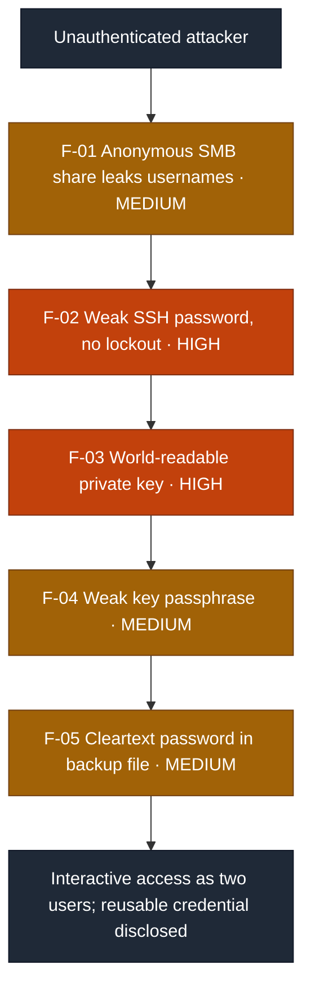
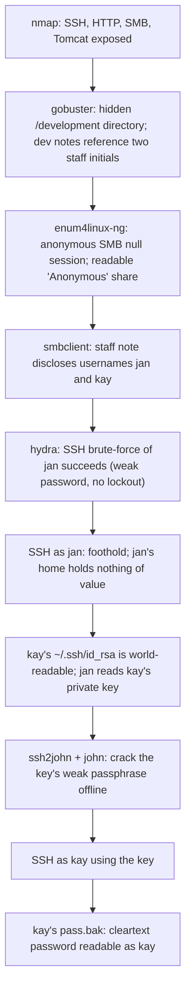

# Security Assessment Report: Network Share to Multi-User Credential Compromise

**Assessment type:** Black-box external compromise of a single Linux host
**Environment:** TryHackMe training target ("Basic Pentesting", Josiah Pierce / Vulnhub)
**Assessor:** ouroboros-white
**Report date:** 2026-08-14
**Version:** 1.0
**Classification:** Public

---

> **About this document.** This is a real assessment against a **lab target**,
> written to professional structure. All reconnaissance, exploitation, and
> evidence collection described here was carried out by me against that target.
> Nothing in it is hypothetical, and none of it is reproduced from a walkthrough.
> It is not a live client engagement, and no production system or third party was
> tested. It documents an unauthenticated compromise that moves through two
> separate user accounts to demonstrate the reporting deliverable: an attack path,
> CVSS-rated findings, detection analysis, and remediation. Target identifiers are
> redacted as they would be in a client report, and no cracked credentials or
> answer strings are reproduced.

---

## 1. Executive summary

A single Linux host exposing web, SSH, and Samba (SMB) file-sharing services was
compromised from an unauthenticated starting point through to interactive access
as two separate user accounts, ending with the recovery of a cleartext password
that plausibly grants administrative control. As with the wider pattern in this
kind of engagement, no single weakness was exotic; the compromise came from
**five ordinary weaknesses chained together**, where each one handed the attacker
the material for the next.

An attacker with no credentials could: read an anonymously exposed file share to
learn valid usernames, brute-force one of those accounts over SSH because the
password was weak and no lockout existed, read a second user's SSH private key
because its file permissions were too open, crack that key's weak passphrase
offline, and finally read a password stored in cleartext in that second user's
home directory. The single most important issue was the **over-permissive private
key**, because it converted a foothold on a throwaway account into takeover of a
more privileged one.

While each finding is rated individually below, **the combined real-world
severity is High**: the chain results in interactive compromise of multiple
accounts and disclosure of a reusable credential. Onward escalation to root is
plausible (the compromised account showed evidence of prior `sudo` use) but was
not exercised within this assessment, and is noted rather than claimed.

### Findings at a glance

| ID | Finding | Severity | CVSS 3.1 |
|----|---------|----------|:--------:|
| F-01 | Anonymous SMB share exposing valid usernames | **Medium** | 5.3 |
| F-02 | Weak SSH password with no account lockout | **High** | 8.1 |
| F-03 | World-readable SSH private key enabling account takeover | **High** | 7.8 |
| F-04 | Weak passphrase protecting the SSH private key | **Medium** | 5.5 |
| F-05 | Cleartext password stored in a home-directory backup file | **Medium** | 5.5 |

**Attack chain at a glance** (severity-highlighted for a management audience):

Each finding also carries a **detection analysis**: the telemetry a monitored
environment would generate and why the activity would or would not be caught.
As with lab targets generally, these are expected detection opportunities rather
than observed fact, because the host carries no instrumentation of its own.

---

## 2. Scope and rules of engagement

| Item | Detail |
|------|--------|
| **In-scope asset** | A single Linux host exposing SSH (22), HTTP (80), Samba/SMB (139, 445), and an Apache Tomcat instance (8080, 8009). |
| **Perspective** | External, black-box, unauthenticated. No credentials or prior knowledge supplied. |
| **Objective** | Achieve and demonstrate the highest level of access obtainable. |
| **Excluded** | Denial-of-service, destructive actions, and any target outside the named host. |
| **Authorisation** | Performed within the TryHackMe platform terms, which authorise exploitation of the provided target. |
| **Window** | 2026-08-14. |

### Target asset

| Attribute | Detail |
|-----------|--------|
| **Hostname** | Redacted, as it would be in a client report (NetBIOS name observed) |
| **IP address** | Redacted. Single in-scope host. |
| **Operating system** | Linux (Ubuntu 20.04 LTS) |
| **Exposed services** | 22/tcp SSH (OpenSSH 8.2p1); 80/tcp HTTP (Apache 2.4.41); 139 and 445/tcp SMB (Samba 4.15.13); 8080/tcp HTTP (Apache Tomcat 9.0.7); 8009/tcp AJP13 |
| **Assessment date** | 2026-08-14 |

---

## 3. Methodology

The assessment followed a standard offensive workflow aligned to the Penetration
Testing Execution Standard (PTES): reconnaissance, enumeration, vulnerability
analysis, exploitation, and post-exploitation / lateral movement, then reporting.
Severity is expressed as CVSS v3.1 base score, and each finding is mapped to a
Common Weakness Enumeration (CWE) identifier. Detection analysis describes
expected detection opportunities, since the target is not instrumented.

**Tooling:** `nmap`, `gobuster`, `enum4linux-ng`, `smbclient`, `hydra`,
`ssh2john` / `john`, and standard SSH and Linux utilities. No custom or
destructive tooling was used.

---

## 4. Attack path

The value of this engagement is the chain, so it is documented as a path before
the findings are detailed individually.

1. **Reconnaissance.** A full-port service scan exposed SSH, HTTP, SMB, and
   Tomcat. Directory brute-forcing of the web root found a hidden `/development`
   directory containing developer notes. Those notes were signed with two
   initials and referenced a weak, already-cracked account, framing the target
   set before any exploitation.
2. **Enumeration (F-01).** The SMB service accepted an anonymous null session and
   exposed a readable share. A staff note inside that share disclosed two valid
   usernames, `jan` and `kay`, turning the initials from the web notes into real
   login names.
3. **Entry (F-02).** `jan`'s SSH password was weak and present in a common
   wordlist, and the host enforced no account lockout, so an online brute-force
   succeeded and yielded an interactive shell as `jan`.
4. **Lateral movement (F-03, F-04).** `kay`'s SSH private key was left readable by
   all users. From the `jan` foothold the key was copied, its weak passphrase was
   recovered offline, and it was used to authenticate as `kay` without ever
   knowing `kay`'s account password.
5. **Credential disclosure (F-05).** As `kay`, a backup file in the home directory
   stored a password in cleartext, disclosing a reusable credential and completing
   the objective.

Each rung depended on the one before it; none required insider access.

---

## 5. Detailed findings

### F-01: Anonymous SMB share exposing valid usernames

| | |
|---|---|
| **Severity** | **Medium** |
| **CVSS 3.1** | 5.3, `AV:N/AC:L/PR:N/UI:N/S:U/C:L/I:N/A:N` |
| **CWE** | CWE-200: Exposure of Sensitive Information to an Unauthorized Actor |
| **Affected component** | Samba (SMB) file-sharing service |
| **Status** | Open |

**CVSS rationale.** `AV:N/PR:N` because the share is read over the network with no
credentials via an anonymous null session; `C:L` because the exposed data is
limited to usernames and an internal note rather than high-value secrets, with
`I:N/A:N` as reading the share neither modifies nor denies data.

**Description.** The SMB service permitted an unauthenticated null session (blank
username and password) and exposed a disk share that any anonymous user could list
and read. The share contained a staff note that named two valid system accounts.

**Evidence (sanitised).** An anonymous SMB session enumerated the service
configuration and listed a readable share. A text file retrieved from that share
was an internal message between staff that referenced both users by full first
name, confirming valid login names for later attack.

**Business impact.** Disclosure of valid usernames removes the guesswork from
credential attacks and directs brute-forcing at real accounts. On its own it is
information disclosure; in this chain it was the precondition for F-02.

**Expected detection opportunities.** Anonymous (null-session) SMB authentication,
access to a share by an unauthenticated principal, and broad SMB enumeration from
a single source in a short window are all detectable at the file-server and
network layers. Not observed here because the host performed no such logging.

**Remediation.** Disable anonymous and guest access to Samba (`map to guest =
never`, `restrict anonymous = 2`). Do not place any file that names users,
systems, or credentials on an anonymously readable share. Require authentication
for all shares and apply least-privilege share permissions.

### F-02: Weak SSH password with no account lockout

| | |
|---|---|
| **Severity** | **High** |
| **CVSS 3.1** | 8.1, `AV:N/AC:L/PR:N/UI:N/S:U/C:H/I:L/A:N` |
| **CWE** | CWE-521: Weak Password Requirements |
| **Affected component** | SSH authentication for the `jan` account |
| **Status** | Open |

**CVSS rationale.** `AV:N/AC:L/PR:N` because the account is accessed over the
network with no prior credentials and the password is present in a common
wordlist; `C:H` because a shell grants full read of that account's data, `I:L`
because the attacker can modify that account's own files, and `A:N` as no denial
results. The account is unprivileged, which is why integrity is scored Low rather
than High.

**Description.** The `jan` account used a weak password that appears in a widely
distributed wordlist, and the host enforced no account-lockout or rate-limiting
policy. An online password-guessing attack against SSH therefore succeeded and
returned an interactive shell.

**Evidence (sanitised).** With `jan` confirmed as a valid username (F-01), an
automated SSH password-guessing tool recovered the account password from a common
wordlist and the credential authenticated successfully, yielding a shell. The
observed password policy set a five-character minimum with no complexity
requirement and no lockout threshold, which is what made the attack viable.

**Business impact.** An unauthenticated external attacker obtains an interactive
foothold on the host. Beyond the immediate account, this foothold was the base
from which the rest of the host was compromised (F-03).

**Expected detection opportunities.** A burst of failed SSH authentications for a
single account from one source, followed by a success, is a high-fidelity
brute-force signature that authentication logs and any SIEM or fail2ban-style
control detect reliably. The absence of a lockout policy is itself a preventive
finding surfaced by configuration review.

**Remediation.** Enforce strong password requirements and, preferably, disable
password authentication for SSH in favour of keys. Introduce account lockout or
progressive rate-limiting (for example fail2ban) and alert on repeated
authentication failure.

### F-03: World-readable SSH private key enabling account takeover

| | |
|---|---|
| **Severity** | **High** |
| **CVSS 3.1** | 7.8, `AV:L/AC:L/PR:L/UI:N/S:U/C:H/I:H/A:H` |
| **CWE** | CWE-732: Incorrect Permission Assignment for Critical Resource |
| **Affected component** | `kay`'s SSH private key (`~/.ssh/id_rsa`) file permissions |
| **Status** | Open |

**CVSS rationale.** `AV:L/PR:L` because reading the key requires the existing
`jan` foothold from F-02; `C:H/I:H/A:H` because possession of the key permits full
takeover of the `kay` account and therefore full control of that account's data
and files.

**Description.** `kay`'s SSH private key was stored with permissions that allowed
any local user to read it. A private key is a credential, so a readable private
key is equivalent to handing that account's login to every user on the system.

**Evidence (sanitised).** From the `jan` shell, `kay`'s home `.ssh` directory was
listable and the private key file was readable by other users. The key was copied
to the attacker's machine for offline processing. The key was passphrase-protected
(see F-04), which was the only control standing between the permission error and
immediate account takeover.

**Business impact.** Lateral movement from a low-value foothold account to a second,
more trusted account, achieved without knowing that account's password and without
any interaction from its owner.

**Expected detection opportunities.** This is primarily a **preventive** finding:
incorrect permissions on a private key are caught by file-integrity and
permission audit, not by a live signal. Detectively, one user reading another
user's `.ssh/id_rsa`, or a subsequent key-based login for `kay` from an unusual
source, are anomalous events that host and authentication monitoring can flag.

**Remediation.** Enforce correct ownership and `600` permissions on all private
keys (SSH refuses over-permissive keys for exactly this reason; the server-side
storage should match). Audit home directories for world- or group-readable secrets,
and prefer per-user key management that keeps private keys off shared hosts.

### F-04: Weak passphrase protecting the SSH private key

| | |
|---|---|
| **Severity** | **Medium** |
| **CVSS 3.1** | 5.5, `AV:L/AC:L/PR:L/UI:N/S:U/C:H/I:N/A:N` |
| **CWE** | CWE-521: Weak Password Requirements |
| **Affected component** | Passphrase on `kay`'s SSH private key |
| **Status** | Open |

**CVSS rationale.** `AV:L/PR:L` because the weakness is only reachable once the key
itself has been obtained (F-03); `C:H` because recovering the passphrase unlocks
the key and the `kay` account, with `I:N/A:N` scored on this finding to avoid
double-counting the takeover impact already attributed to F-03. The score reflects
a defence-in-depth control that failed rather than the primary access vector.

**Description.** The private key was encrypted with a passphrase, which is good
practice, but the passphrase itself was weak and present in a common wordlist. The
encryption therefore provided no meaningful protection once the key was readable.

**Evidence (sanitised).** The encrypted key was converted to a crackable hash and
its passphrase was recovered offline from a common wordlist in negligible time.
The recovered passphrase then unlocked the key and authenticated the attacker as
`kay`.

**Business impact.** The one control that should have contained the F-03 permission
error (passphrase encryption) was defeated trivially, so a readable key became a
full account takeover. Because cracking is offline, it produces no telemetry on the
target and is not subject to lockout.

**Expected detection opportunities.** None at the point of cracking, which is
offline and off-host. This is a **preventive** finding: enforce strong key
passphrases by policy. The only related runtime signal is the eventual key-based
login as `kay` from an unexpected source (shared with F-03).

**Remediation.** Require strong, high-entropy passphrases on all private keys, and
treat passphrase strength as part of key-management policy. Rotate any key whose
passphrase may be weak, and consider hardware-backed keys that cannot be exfiltrated
and cracked offline.

### F-05: Cleartext password stored in a home-directory backup file

| | |
|---|---|
| **Severity** | **Medium** |
| **CVSS 3.1** | 5.5, `AV:L/AC:L/PR:L/UI:N/S:U/C:H/I:N/A:N` |
| **CWE** | CWE-312: Cleartext Storage of Sensitive Information |
| **Affected component** | Backup file in `kay`'s home directory |
| **Status** | Open |

**CVSS rationale.** `AV:L/PR:L` because reading the file requires access as `kay`
(F-03, F-04); `C:H` because it discloses a cleartext, reusable credential, with
`I:N/A:N` as reading it neither alters nor denies data.

**Description.** A backup file in `kay`'s home directory stored a password in
cleartext. Credentials in plaintext on disk are recoverable by anyone who reaches
that account and are frequently reused across services and for privilege
escalation.

**Evidence (sanitised).** After authenticating as `kay`, a backup file readable by
that account contained a password in plaintext. The value is not reproduced here.

**Business impact.** Disclosure of a reusable credential. Where such a password is
reused for `sudo`, another service, or another host, its exposure extends the
compromise beyond this account. The compromised account showed evidence of prior
successful `sudo` use, so this credential is a plausible path to administrative
control, though root was not exercised in this assessment.

**Expected detection opportunities.** Primarily **preventive**: secrets-scanning of
home directories and file shares detects plaintext credentials at rest. Detectively,
any subsequent use of the disclosed password (for example a `sudo` session or a new
login) from an unexpected context is the observable follow-on event.

**Remediation.** Never store passwords in cleartext on disk. Use a secrets manager
or an encrypted credential store, remove existing plaintext copies, and rotate any
credential that has been stored this way. Where a stored secret grants `sudo`,
treat its exposure as an administrative-credential incident.

---

## 6. Remediation roadmap

| Priority | Action | Findings |
|:--------:|--------|----------|
| **1 (Now)** | Correct private-key permissions to `600` and audit home directories for readable secrets | F-03 |
| **2 (Now)** | Remove the cleartext password file and rotate the disclosed credential | F-05 |
| **3 (Now)** | Enforce strong SSH passwords or key-only auth, plus account lockout / rate-limiting | F-02 |
| **4 (Now)** | Disable anonymous / guest SMB access and remove user-naming content from shares | F-01 |
| **5 (Soon)** | Require strong passphrases on all private keys and rotate weak ones | F-04 |
| **6 (Ongoing)** | Establish secrets-at-rest scanning and least-privilege review across the estate | All |

---

## 7. Conclusion

This host was taken from anonymous to interactive control of two user accounts
through five commonplace weaknesses, none sophisticated, chained so that each
unlocked the next: an anonymously readable share that leaked usernames, a weak
password with no lockout to stop guessing, a private key any user could read, a
passphrase that offered no real protection, and a password left in cleartext on
disk. The unifying lesson is the same one that recurs across these assessments:
**no single trusted assumption should be enough to hand over the next level of
access.** The most cost-effective fix here is also the highest-leverage one,
correcting the private-key permissions, because that single link is what turned a
throwaway foothold into takeover of a trusted account. Every link was individually
cheap to fix.

---

## Appendix A: Severity methodology

Severity is CVSS v3.1 base score. Bands: Critical 9.0 to 10.0, High 7.0 to 8.9,
Medium 4.0 to 6.9, Low 0.1 to 3.9.

Two scoring choices in this set are worth stating, because the base scores and the
attack path pull in different directions. First, F-02 is scored `I:L` and F-04 is
scored `I:N/A:N` deliberately: taken literally, a shell and an account takeover
each imply full integrity and availability impact, but scoring every rung at
`C:H/I:H/A:H` would multiply the same real-world outcome across several findings
and inflate the picture. The impact of the takeover is attributed once, to the
permission error that causes it (F-03), and the surrounding findings are scored for
their own distinct contribution. Second, F-03, F-04, and F-05 all carry `AV:L`,
which prices them as though the attacker must already be local. They do become
reachable only after the F-02 foothold, but F-02 supplies that foothold
unauthenticated and in one step, so read in sequence these are not
post-compromise hardening items but the mechanism by which a network-facing weak
password becomes takeover of a trusted account. Where the base score and the
attack path disagree in that way, the remediation roadmap follows the path.

## Appendix B: Tooling

`nmap` (service and version enumeration), `gobuster` (web content discovery),
`enum4linux-ng` (SMB enumeration), `smbclient` (share access), `hydra` (SSH
password attack), `ssh2john` and `john` (offline passphrase recovery), and
standard SSH and Linux utilities. No custom or destructive tooling was used.
