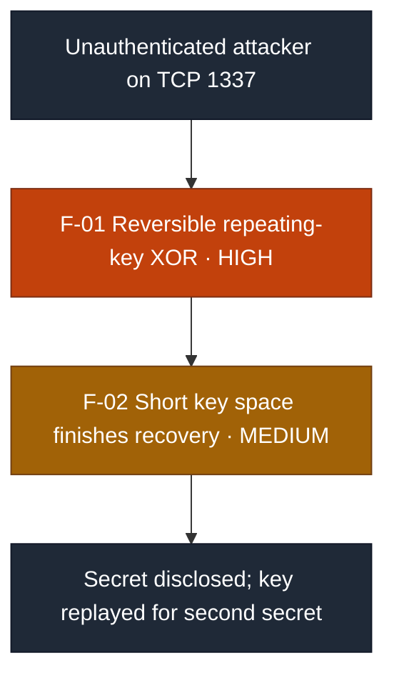
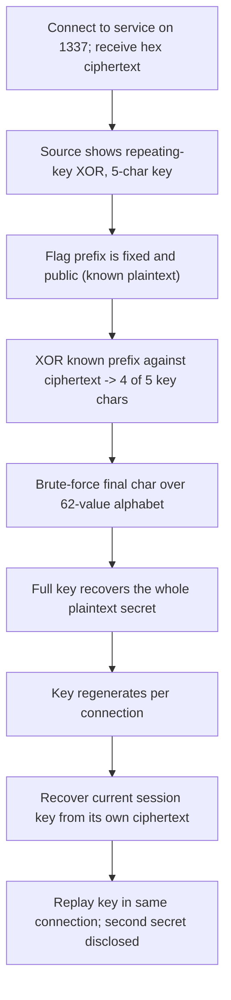

# Security Assessment Report: Recoverable XOR Cryptosystem

**Assessment type:** Black-box cryptographic assessment of a network service
**Environment:** TryHackMe training target ("Wise Guy" cryptography challenge), a custom XOR-based flag service on TCP 1337
**Assessor:** ouroboros-white
**Report date:** 2026-08-21
**Version:** 1.0
**Classification:** Public

---

> **About this document.** This is a real assessment against a **lab target**,
> written to professional structure. All analysis, exploitation, and evidence
> collection described here was carried out by me against that target. Nothing in
> it is hypothetical, and none of it is reproduced from a walkthrough. It is not a
> live client engagement, and no production system or third party was tested. It
> documents a cryptographic weakness in a custom cipher to demonstrate the
> reporting deliverable: an attack path, CVSS-rated findings, detection analysis,
> and remediation. Target identifiers are redacted as they would be in a client
> report, and no flags, keys, or recovered secrets are reproduced.

---

## 1. Executive summary

A network service that protects a secret ("flag") with a **custom XOR cipher** was
assessed from an unauthenticated position, working from the service on TCP 1337
and its published source. The secret was fully recovered, and the encryption key
was reconstructed and replayed to the service to obtain a second protected secret.

The cipher is a **repeating-key XOR** with a random five-character key. Two
properties make it trivially reversible. First, XOR is its own inverse, so
ciphertext combined with known plaintext yields the key directly. Second, the
protected value has a **fixed, publicly known prefix** (every flag begins the same
way), which hands an attacker most of a five-character key for free and reduces the
remainder to a 62-way guess. Once any full key-length of plaintext is known, the
entire key follows from a single operation with no guessing at all.

The service regenerates the key on each connection, which prevents a captured key
from being reused later but does nothing to stop key recovery within a connection.
An unauthenticated attacker can therefore decrypt the protected value on any
connection and, by replaying the recovered key in the same session, retrieve the
second secret the service gates behind it.

The most serious issue is the **use of a structurally broken cipher** (F-01),
which known plaintext reverses to recover most of the key; the **short key space**
(F-02) then reduces the remainder to a trivial brute force, collapsing the work to
seconds.

### Findings at a glance

| ID | Finding | Severity | CVSS 3.1 |
|----|---------|----------|:--------:|
| F-01 | Recoverable repeating-key XOR cipher (known-plaintext key recovery) | **High** | 7.5 |
| F-02 | Short key and fixed known plaintext prefix collapse the key space | **Medium** | 5.3 |

**Attack chain at a glance** (severity-highlighted for a management audience):
known-plaintext XOR reversal (F-01) recovers most of the key directly, and the
short key space (F-02) makes the remainder a trivial brute force, disclosing the
protected secret.

Each finding carries a **detection analysis**: the telemetry a monitored
environment would generate. As with lab targets generally, these are expected
detection opportunities, since the service carries no instrumentation of its own.

---

## 2. Scope and rules of engagement

| Item | Detail |
|------|--------|
| **In-scope asset** | A single TCP network service on port 1337, and its published source. |
| **Perspective** | Unauthenticated, remote. |
| **Objective** | Recover the protected secret and demonstrate the impact of the cipher weakness. |
| **Excluded** | Denial-of-service, and any target outside the named service. |
| **Authorisation** | Performed within the TryHackMe platform terms, which authorise exploitation of the provided target. |
| **Window** | 2026-08-21. |

### Target asset

| Attribute | Detail |
|-----------|--------|
| **Hostname / IP** | Redacted, as it would be in a client report |
| **Service** | Custom TCP service (Python `socketserver`) |
| **Exposed port** | 1337/TCP |
| **Cryptography** | Repeating-key XOR, random five-character key, hex-encoded output |
| **Perspective** | Unauthenticated, remote |
| **Assessment date** | 2026-08-21 |

---

## 3. Methodology

The assessment followed a standard cryptographic-analysis workflow: review the
published source to model the cipher, identify the properties that make it
reversible, recover the key, and demonstrate impact by decrypting the protected
value and replaying the key. Severity is expressed as CVSS v3.1 base score, and
each finding is mapped to a Common Weakness Enumeration (CWE) identifier. Attacker
behaviour is mapped to MITRE ATT&CK in section 4. Detection analysis describes
expected detection opportunities, since the target is not instrumented, and a
retesting procedure in section 7 states how each fix would be verified.

A methodological note that affected the result: the published source contains a
**placeholder value** in place of the real protected secret, and the key is
regenerated on every connection. Recognising both facts (that the real value lives
only on the live service, and that a key recovered from one connection is valid
only for that connection) was necessary to move from decrypting a static capture
to recovering the secret live.

**Tooling:** `nc` (Netcat), Python 3 (`bytes.fromhex`, a hand-written XOR routine),
and standard shell utilities. No custom or destructive tooling was used.

---

## 4. Attack path

### ATT&CK technique mapping

Attacker behaviour is mapped to MITRE ATT&CK (Enterprise) so the work can be read
against a defender's coverage.

| Stage | Finding | Tactic | Technique |
|---|---|---|---|
| Reviewing the published cipher source | n/a | Reconnaissance | T1592.002 Gather Victim Host Information: Software |
| Recovering the key from known plaintext and decrypting | F-01, F-02 | Credential Access | T1600.001 Weaken Encryption: Reduce Key Space |
| Decrypting captured protected data | F-01 | Collection | T1005 Data from Local System |

Reconnaissance produced no reportable finding, so that row carries `n/a` in the
Finding column. T1600 (Weaken Encryption) is ordinarily framed against network
devices; it is used here because the substance of the attack is the reduction of an
already weak key space to a recoverable one, which is the behaviour a defender
would reason about.

---

## 5. Detailed findings

### F-01: Recoverable repeating-key XOR cipher (known-plaintext key recovery)

| | |
|---|---|
| **Severity** | **High** |
| **CVSS 3.1** | 7.5, `AV:N/AC:L/PR:N/UI:N/S:U/C:H/I:N/A:N` |
| **CWE** | CWE-327: Use of a Broken or Risky Cryptographic Algorithm |
| **Affected component** | Custom XOR encryption routine |
| **Status** | Open |

**CVSS rationale.** `AV:N/PR:N/UI:N` because any unauthenticated remote party can
interact with the service; `AC:L` because XOR is its own inverse and the recovery
requires no special conditions; `C:H` for full disclosure of the protected secret,
with `I:N/A:N` as the cipher weakness neither alters data nor affects availability.

**Description.** The service protects its secret with a repeating-key XOR cipher.
XOR is a reversible, symmetric operation: for any position,
`plaintext XOR ciphertext = key` and `key XOR ciphertext = plaintext`. An attacker
who knows, or can guess, a stretch of plaintext therefore recovers the
corresponding key bytes directly from the ciphertext, and a repeating key means
those bytes then decrypt the entire message. XOR alone provides confidentiality
only when the key is truly random, at least as long as the message, and never
reused, which is the one-time-pad condition. A short repeating key meets none of
these.

**Evidence (sanitised).** From the ciphertext the service returns on connection,
the full key was reconstructed and the complete plaintext secret recovered. The
recovered key was then replayed to the service, which validated it and released a
second protected secret. No values are reproduced here, in line with the reporting
policy.

**Business impact.** Any data protected by this cipher must be treated as
plaintext to an attacker who can see the ciphertext. Where such a scheme protects
real secrets (credentials, tokens, personal data), confidentiality is entirely
absent despite the appearance of encryption, which can also create false assurance
in a compliance or data-protection context.

**Expected detection opportunities.** Key recovery itself is an offline computation
and produces no signal. The observable behaviour is at the network layer: repeated
connections to the service and repeated key submissions, including failed ones,
from a single source in a short window. Alert on connection bursts and repeated
failed authentication or key-validation attempts against the service.

**Remediation.** Do not use XOR, or any bespoke construction, as a cipher. Use a
vetted authenticated encryption scheme (for example AES-256-GCM or
ChaCha20-Poly1305) from a maintained library, with a full-length key from a
cryptographically secure generator. Never design cryptography in-house.

### F-02: Short key and fixed known plaintext prefix collapse the key space

| | |
|---|---|
| **Severity** | **Medium** |
| **CVSS 3.1** | 5.3, `AV:N/AC:L/PR:N/UI:N/S:U/C:L/I:N/A:N` |
| **CWE** | CWE-326: Inadequate Encryption Strength |
| **Affected component** | Key generation and message format |
| **Status** | Open |

**CVSS rationale.** `C:L` because on its own this finding weakens rather than
directly discloses; its real weight is as the amplifier for F-01, which the
executive summary captures as the combined outcome. Vector and complexity match
F-01 because the same unauthenticated, low-complexity interaction applies.

**Description.** Two design choices make F-01 instant rather than merely possible.
The key is only five characters, drawn from a 62-character alphabet, so even a
blind search is small. More importantly, the protected value has a **fixed,
publicly known prefix**: every flag begins the same way. XORing that known prefix
against the ciphertext recovers four of the five key characters with certainty,
leaving a single character to guess over 62 possibilities. Once any full
key-length of plaintext is known, the entire key follows with no guessing at all.
Encrypting data whose format is already public with a key shorter than that known
prefix provides no meaningful strength.

**Business impact.** Reduces key recovery from a theoretical weakness to a
few-seconds exercise, which is what turns F-01 from a design flaw into a practical
compromise. Any comparable scheme (short key, predictable message structure) is
similarly exposed.

**Expected detection opportunities.** As with F-01, the recovery is offline; the
observable tell is a short burst of connections and key-submission attempts. A key
space this small also means an attacker may not need many attempts, so a low count
of failed submissions is not by itself reassuring.

**Remediation.** Use full-length random keys as part of adopting an authenticated
cipher (F-01). Do not rely on the secrecy of a short key, and design so that
knowledge of the message format confers no advantage. Where a value must carry a
recognisable prefix, that prefix must not weaken the protection around it.

---

## 6. Remediation roadmap

| Priority | Action | Findings |
|:--------:|--------|----------|
| **1 (Now)** | Replace the XOR routine with a vetted authenticated cipher (AES-256-GCM or ChaCha20-Poly1305) from a maintained library | F-01 |
| **2 (Now)** | Generate full-length keys from a cryptographically secure source; stop relying on a short secret | F-02 |
| **3 (Ongoing)** | Adopt a policy of no in-house cryptography; review any custom encoding or "encryption" against known-plaintext and key-reuse weaknesses | All |

---

## 7. Retesting

| Finding | Verification that the fix holds |
|---|---|
| **F-01** | Confirm ciphertext no longer decrypts when known plaintext is XORed against it; confirm the cipher is a named authenticated construction from a maintained library, not a custom routine. |
| **F-02** | Confirm keys are full-length and drawn from a secure generator; confirm that knowledge of the message prefix yields no key material and does not reduce the search. |

---

## 8. Conclusion

The service looked encrypted and was not. XOR with a short, repeating key is an
encoding, not a cipher: it is reversible by anyone who sees the ciphertext and
knows any stretch of the plaintext, and a fixed public prefix guarantees that
knowledge. The lesson generalises past this one service: **confidentiality comes
from a sound, vetted algorithm with a proper key, never from a home-made scheme or
the secrecy of a short key.** Rolling your own cipher reliably produces something
that looks like protection and provides none.

---

## Appendix A: Severity methodology

Severity is CVSS v3.1 base score. Bands: Critical 9.0 to 10.0, High 7.0 to 8.9,
Medium 4.0 to 6.9, Low 0.1 to 3.9. F-01 is rated Attack Complexity Low because XOR
reversal requires no special conditions once any known plaintext is available; the
fixed flag prefix guarantees that availability, which is the substance of F-02.

## Appendix B: Tooling

`nc` (Netcat) for interacting with the service, Python 3 (`bytes.fromhex` and a
hand-written XOR routine) for key recovery and decryption, and standard shell
utilities. No custom or destructive tooling was used.

## Appendix C: What I learnt

The known-plaintext attack is the practical heart of this: a cipher that leaks its
key to anyone holding a matching stretch of plaintext offers no confidentiality,
and a predictable message format supplies that plaintext for free. The wider
discipline point is operational, not cryptographic. The interactive interpreter
forgets its state on exit, and the key regenerated on every connection, so a result
tied to one captured session did not transfer. Working from a saved script, and
recovering each session's key from that session's own ciphertext, was what turned a
one-off decryption into a repeatable attack.
