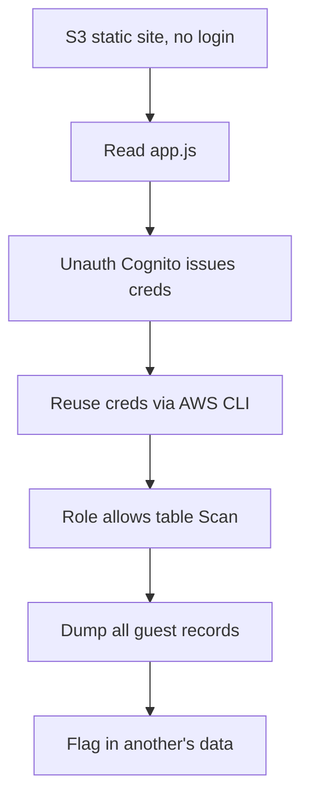

# Complimentary

**Platform:** TryHackMe (Hacker Holidays) · **Difficulty:** Easy · **Date:** 2026-07-30
**Tags:** Cloud, AWS, Cognito, DynamoDB, Broken Access Control

## The target

A "free wellness" web app hosted as an Amazon S3 static site. No login and no
sign-up: every visitor is set up as a guest the moment they arrive. The
objective was to work out how the app knows anything about you without an
account, then see what else those behind-the-scenes credentials would hand over.

This was my first time working a cloud environment, so the shift from "find a
hidden path" to "read what the app already trusts" was the mindset I had to build.

## What I tried

The app would not load over HTTPS in my local browser (S3 website endpoints are
HTTP-only), but a ping confirmed it resolved to an S3 website address, so it was
live. It loaded fine from the AttackBox.

Content discovery with gobuster only surfaced the index page and S3's own XML
error responses, so brute-forcing paths was a dead end. The useful move was
reading the page's own source: the HTML is an empty shell that loads the AWS SDK
for JavaScript and its own `app.js`. A browser app cannot hide its logic, so
`app.js` was where the answer had to be.

Reading `app.js` gave the whole mechanism:

- It uses an **unauthenticated Cognito Identity Pool** to hand real, temporary
  AWS credentials to any visitor with no login. That is the "complimentary"
  access the app advertises.
- It reads the visitor's record from a DynamoDB table
  (`complimentary-GuestWellnessProfiles`) with `getItem`, keyed by a
  self-assigned random `guest_id`.

The tell: the app only ever requests *your own* record, but that restriction
lives in the JavaScript, not in the credentials.

## What worked

If the app hands every visitor real AWS credentials, the only thing stopping me
reading other people's data is what that credential's IAM role is *allowed* to
do. So I took the same guest credentials the browser gets and asked DynamoDB to
read the whole table instead of a single row.

```bash
# 1. Get a guest identity, then temporary AWS creds for it. The calls are
#    unauthenticated, so --no-sign-request: there are no credentials to sign
#    the request with yet.
aws cognito-identity get-id --identity-pool-id <pool-id> --region us-east-1 --no-sign-request
aws cognito-identity get-credentials-for-identity --identity-id <identity-id> --region us-east-1 --no-sign-request

# 2. Load those temporary creds, then confirm which identity I now hold.
aws sts get-caller-identity

# 3. Read the entire table, not just my own record.
aws dynamodb scan --table-name complimentary-GuestWellnessProfiles --region us-east-1
```

One useful detour: `get-caller-identity` first showed an EC2 instance role
(`assumed-role/vulnerable-machine/i-...`) instead of the Cognito identity. The
`i-...` session name is the giveaway that you are using a machine's
instance-metadata role, not the credentials you meant to load. Reading the ARN
tells you which identity you actually hold before you rely on it.

The scan returned every guest's record. Structure, with values redacted:

```
{
  "guest_id": { "S": "guest-..." },
  "name":     { "S": "<name>" },
  "email":    { "S": "<email address>" },
  "phone":    { "S": "+1-555-...." },
  "location": { "S": "<GPS coordinates>" },
  "password": { "S": "<plaintext password>" },
  "notes":    { "S": "<free-text notes>" }
}
```

The flag was in one guest's record.

## Attack chain



## Finding & fix

**Severity:** High. CVSS 3.1 `AV:N/AC:L/PR:N/UI:N/S:U/C:H/I:N/A:N` (7.5),
CWE-732 (incorrect permission assignment); the plaintext-password storage is a
separate Medium (CWE-256) that amplifies this to account-takeover severity.
**Business impact:** a reportable personal-data breach (UK GDPR): every guest's
PII and reusable password exposed to any anonymous visitor.

**Finding:** access control lived only in the client-side JavaScript. The
unauthenticated Cognito guest role was permitted to `Scan` the whole DynamoDB
table, so any anonymous visitor could read every guest's plaintext password, GPS
location, email, and phone number. The app choosing to request one row never
constrained what the credentials could actually do.

**Fix:** scope the unauthenticated role to least privilege. Allow only `GetItem`
on the caller's own key using DynamoDB fine-grained access (a
`dynamodb:LeadingKeys` condition tied to the identity), never `Scan` on the
table. Don't store passwords in plaintext, and don't let an unauthenticated role
reach customer PII at all.
