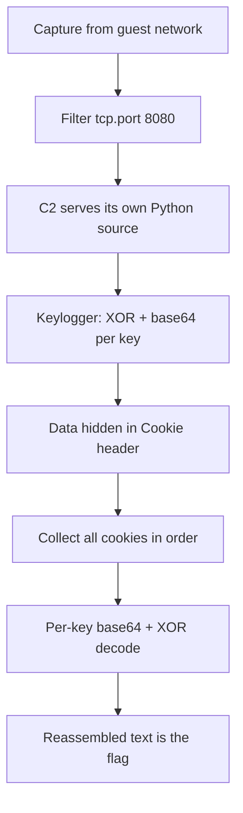

# Packed Light

**Platform:** TryHackMe (Hacker Holidays, Day 4) · **Difficulty:** Easy · **Date:** 2026-07-30
**Tags:** Network Forensics, PCAP Analysis, Cryptography

## The target

A short packet capture from the hotel guest network. Something was exfiltrating
data a little at a time, "folded neatly inside traffic that looks ordinary." The
brief pointed at a periodic beacon to a `:8080` host that was not a real hotel
service. The goal: find the covert channel, reassemble the hidden data, and
decode it.

## What I tried

The room's own hints did a lot of the pointing: regular beaconing to a `:8080`
address, request headers that looked like "not a real app," and a mention of
"crypto." So I opened the capture in Wireshark and filtered to the beacon:

```
tcp.port == 8080
```

Following the HTTP stream of one request, the C2 server
(`byte-lotus-hotel.thm:8080`) was serving its own client script back as
`text/x-python`. Reading that source gave the entire mechanism.

## What worked

The client is a **keylogger with an HTTP covert channel**. For every keystroke,
its `sendltr()` function:

1. XOR-encrypts the character with a hardcoded key (`getkey()`, two strings
   concatenated).
2. base64-encodes the result.
3. hides it in a **Cookie header**: `Cookie: hotel_sess_state=<base64>`, then
   sends a GET to the C2.

The fake `ByteLotusClient/1.1` User-Agent is the "not a real app" tell. So the
exfiltrated data is smuggled out one keystroke per request, inside the Cookie
header.

To recover it:

- **Reassemble:** each beacon request carries one keystroke's Cookie value, so I
  collected them in packet order. In Wireshark, applying `http.cookie` as a
  column shows every request's cookie value at once.
- **Decode:** reverse the malware's own steps. Each cookie value is base64 of a
  single XOR-encrypted byte, so it has to be decoded per keystroke, not as one
  blob. I used CyberChef:

```
Fork (split on newline)  ->  From Base64  ->  XOR (key = the getkey() value, UTF-8)
```

Splitting the values one per line first was the key detail: base64 works in
fixed groups, so gluing them together and decoding as one scrambles the
boundaries. Decoded per keystroke and joined, the Cookie values spelled out the
typed text: a `THM.....` flag.

## Attack chain



## Finding & fix

**Finding:** a keylogger exfiltrated keystrokes over a covert HTTP channel,
encoding each one (XOR then base64) into a Cookie header on a periodic beacon to
an external C2. Dressed up as ordinary session-cookie traffic, it blended into
normal-looking web requests.

**Fix:** this is a detection and egress-control problem, not a single patch. The
tell-tale signs are all here to alert on: fixed-interval beaconing, an
unrecognised User-Agent, and cookies carrying high-entropy data rather than
normal session tokens. Restrict outbound traffic from guest devices to known
services, and alert on periodic connections to unknown external hosts. Endpoint
controls should also catch the keylogger itself, an unsigned script hooking the
keyboard.
