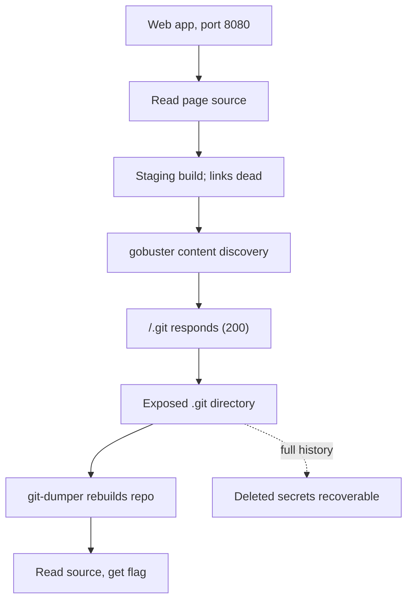

# Room 404

**Platform:** TryHackMe (Hacker Holidays) · **Difficulty:** Easy · **Date:** 2026-07-28
**Tags:** Web, Source Disclosure, Recon

## The target

A web app on port 8080. The briefing pointed at "the rooms it never lists" and
asked me to "dump the exposed source code", so the goal was to find something
the site did not link to and pull its source.

## What I tried

I started by reading the page rather than reaching for tools. Viewing source
showed every nav link was a dead `#` placeholder except one real path,
`/booking`, and the footer described the site as a "build staging". `/booking`
returned 404, so that link was a dead end. The staging hint told me this was a
rushed deploy, which is exactly where developers leave things behind.

I then ran gobuster against the site with a common wordlist and file extensions
(`-x php,txt,zip,bak,git`), reasoning that "exposed source code" meant a file or
folder the site did not link to. I also had the manual habit of checking
`robots.txt` and `/.git/` by hand.

## What worked

Gobuster returned `/.git` and `/.git/HEAD`, both HTTP 200. That is the tell: the
developer had deployed the entire project folder, `.git` included, and left it
web-accessible. An exposed `.git` directory holds everything needed to rebuild
the project: `HEAD` and `config`, the `refs/`, `info/`, and `logs/` entries, and
the `objects/` store that holds the actual file contents as compressed git
objects.

Rather than pull those one at a time, I used **git-dumper** to mirror the whole
`.git` directory and reconstruct the working tree in one pass:

```
git-dumper http://<target>:8080/.git /tmp/loot
```

That rebuilt the repository into `/tmp/loot`. From there I ran `ls -la` to list
everything including hidden files, found a README in the recovered source, and
read it to get the flag. Because git-dumper recovers the objects and refs, the
full commit history comes with the source, not just the current files.

## Attack chain



## Finding & fix

**Finding:** the server exposed its `.git` directory, disclosing the full source
*and its history*. This is a common real-world misconfiguration: deploying by
copying the whole working folder instead of a built artifact. Anything ever
committed stays recoverable from the object store, including secrets that were
"removed" in a later commit but never actually purged from history.

**Fix:** never deploy the `.git` directory to production. Deploy build output
rather than the repository, and block access to `.git` at the web-server level
as a backstop.
